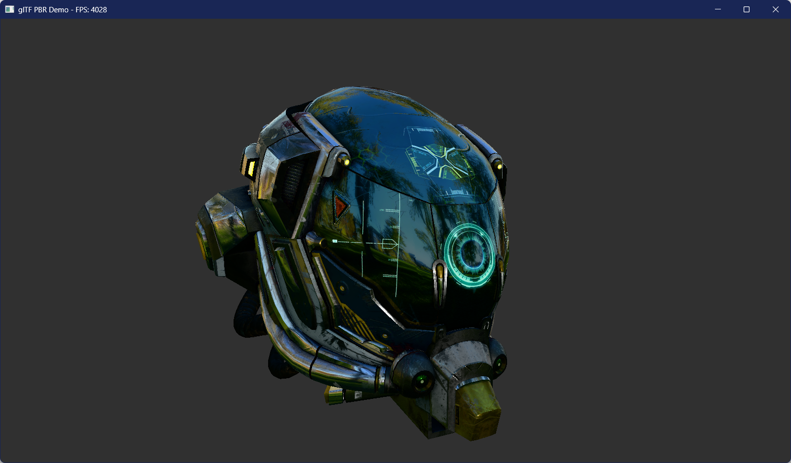
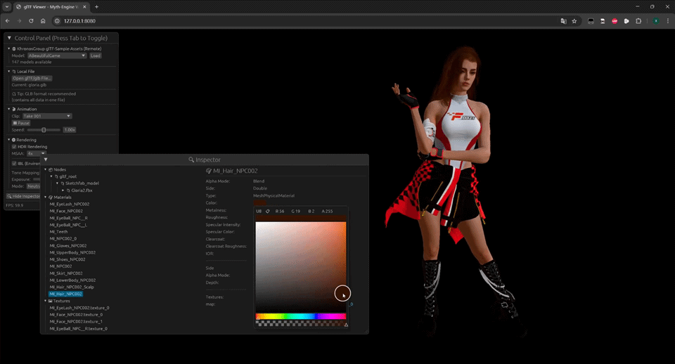

<div align="center">

# Myth

**A High-Performance, WGPU-Based Rendering Engine for Rust.**

[](https://github.com/panxinmiao/myth/actions/workflows/ci.yml)
[](https://github.com/panxinmiao/myth/actions/workflows/deploy.yml)
[](LICENSE)
[](https://gpuweb.github.io/gpuweb/)



[**Showcase**](https://panxinmiao.github.io/myth/) | [**glTF Viewer & Inspector**](https://panxinmiao.github.io/myth/gltf_viewer/)  | [**Examples**](examples/)

</div>

---

> ⚠️ **Warning: Early Development Stage**
>
> Myth is currently in **active alpha development**. APIs are unstable and subject to **drastic breaking changes**. 

## Introduction

**Myth** is a developer-friendly, high-performance 3D rendering engine written in **Rust**. 

Inspired by the simplicity of **Three.js** and built on the modern power of **wgpu**, Myth aims to bridge the gap between low-level graphics APIs and high-level game engines. It provides a familiar object-oriented API for rapid development, backed by a **Transient Render Graph** architecture for industrial-grade performance.


## Features

* **Modern Architecture**: Built on **wgpu**, fully supporting **Vulkan**, **Metal**, **DX12**, and **WebGPU**.
* **Advanced PBR Materials**: Physically Based Rendering with a rich set of material features:
    * **IBL** (support cubeMap & equirectangular env maps, with auto PMREM generation).
    * **Clearcoat** (car paint, varnished wood).
    * **Iridescence** (soap bubbles, oil films).
    * **Sheen** (cloth-like materials).
    * **Anisotropy** (brushed metals).
    * **Transmission** (glass, water).
* **SSAO**: Screen Space Ambient Occlusion for enhanced depth perception.
* **Full glTF 2.0 Support**: Complete support for glTF 2.0 specification, including PBR materials, animations, and scene hierarchy.
* **HDR Rendering Pipeline**: Full support for HDR Rendering, various tone mapping mode.
* **Post-Processing Effects**: Built-in support for physically-based bloom.
    * **HDR Bloom** Physically-based bloom.
    * **Color Grading**: Built-in support for 3D LUT-based color grading.
    * **Contrast & Saturation**: Adjustable contrast and saturation controls.
    * **Film Grain**: Realistic film grain effect with adjustable intensity and size.
    * **Chromatic Aberration**: Simulate lens distortion with adjustable intensity and direction.
    * **Vignette Effect**: Adjustable vignette effect with intensity, smoothness, and color controls.
* **Skybox & Background**: Color, gradient, image, cubemap, and equirectangular sky rendering modes.
* **Anti-Aliasing**: Built-in MSAA and FXAA support.
* **Shadows**: Cascaded shadow maps.
* **Transient Render Graph**: A highly optimized, frame-graph based rendering architecture that minimizes overhead and maximizes flexibility.
* **Asset System**: Asynchronous asset loading with `AssetServer`, built-in **glTF 2.0** support (geometry, materials, animations).
* **Tooling Ready**: Includes a powerful `gltf_viewer` example with an embedded **Inspector UI** (based on egui), capable of inspecting scene nodes, materials, and textures at runtime.
* **Web First**: First-class support for **WASM** and **WebGPU**. Write once, run everywhere.

## Online Demo

Experience the engine directly in your browser (Chrome/Edge 113+ required for WebGPU):

- **[Showcase (Home)](https://panxinmiao.github.io/myth/)**: High-performance rendering showcase.
- **[Launch glTF Viewer & Inspector](https://panxinmiao.github.io/myth/gltf_viewer/)**: Inspect your glTF models online.

* **Drag & Drop** your own `.glb` files to view them.
* Inspect node hierarchy and tweak PBR material parameters in real-time.




## Quick Start

Add `myth` to your `Cargo.toml`:

```toml
[dependencies]
myth = { git = "https://github.com/panxinmiao/myth", branch = "main" }

```

### The "Hello World" (Three.js Style)

A spinning cube with a checkerboard texture within less than 50 lines of code.
Notice how similar this feels to the JS equivalent, but statically typed:

```rust
use myth::prelude::*;

struct MyApp;

impl AppHandler for MyApp {
    fn init(engine: &mut Engine, _: &dyn Window) -> Self {
        // 0. Create a Scene
        let scene = engine.scene_manager.create_active();

        // 1. Create a cube mesh with a checkerboard texture using builder-style chaining
        let texture = Texture::create_checkerboard(Some("checker"), 512, 512, 64);
        let tex_handle = engine.assets.textures.add(texture);
        let mesh_handle = scene.spawn_box(1.0,1.0,1.0,MeshPhongMaterial::new(Vec4::new(1.0, 0.76, 0.33, 1.0)).with_map(tex_handle));
        
        // 2. Setup Camera
        let cam_node_id = scene.add_camera(Camera::new_perspective(45.0, 1280.0 / 720.0, 0.1));
        scene.node(&cam_node_id).set_position(0.0, 0.0, 5.0).look_at(Vec3::ZERO);
        scene.active_camera = Some(cam_node_id);
        
        // 3. Add Light
        scene.add_light(Light::new_directional(Vec3::ONE, 5.0));

        // 4. Setup update callback to rotate the cube
        scene.on_update(move |scene, _input, _dt| {
            if let Some(node) = scene.get_node_mut(mesh_handle) {
                let rot_y = Quat::from_rotation_y(0.02);
                let rot_x = Quat::from_rotation_x(0.01);
                node.transform.rotation = node.transform.rotation * rot_y * rot_x;
            }
        });
        
        Self {}
    }
}

fn main() -> myth::Result<()> {
    App::new().with_title("Myth-Engine Demo").run::<MyApp>()
}
```

### Running Examples

Clone the repository and run the examples directly:

```bash
# Run the earth example
cargo run --example earth --release

# Run the glTF Viewer (Desktop)
cargo run --example gltf_viewer --release

# Run the glTF Viewer (Web/WASM)
# gltf_viewer example also includes an embedded Inspector UI
./scripts/build_wasm.sh gltf_viewer
python -m http.server 8080 --directory examples\gltf_viewer\web

# Run the Showcase example (Web/WASM)
./scripts/build_wasm.sh showcase
python -m http.server 8080 --directory examples\showcase\web

```

## License

This project is licensed under the **MIT License** or **Apache-2.0 License**.