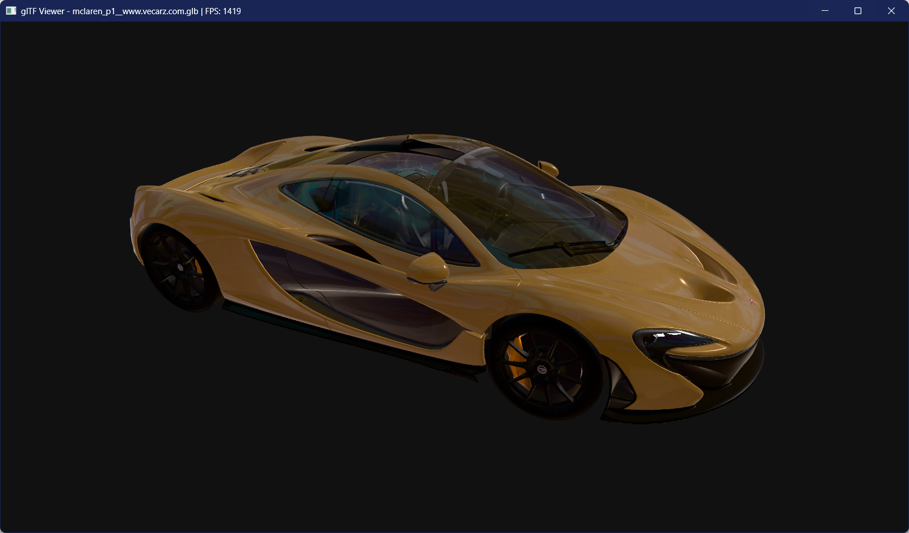
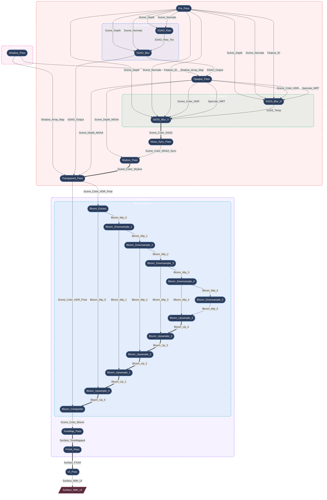
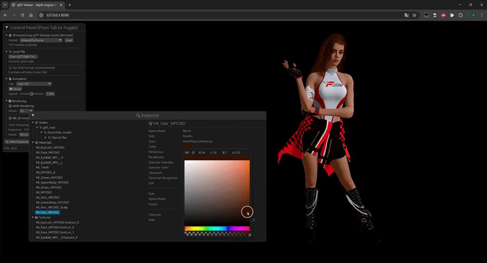

<div align="center">

# Myth

**A High-Performance, WGPU-Based Rendering Engine for Rust.**

[](https://github.com/panxinmiao/myth/actions/workflows/ci.yml)
[](https://github.com/panxinmiao/myth/actions/workflows/deploy.yml)
[](LICENSE)
[](https://gpuweb.github.io/gpuweb/)



[**Showcase**](https://panxinmiao.github.io/myth/) | [**glTF Viewer & Inspector**](https://panxinmiao.github.io/myth/gltf_viewer/)  | [**Examples**](examples/)

</div>

---

> ⚠️ **Warning: Early Development Stage**
>
> Myth is currently in **active alpha development**. APIs are unstable and subject to **drastic breaking changes**. 

## Introduction

**Myth** is a developer-friendly, high-performance 3D rendering engine written in **Rust**. 

Inspired by the ergonomic simplicity of **Three.js** and built on the modern power of **wgpu**, Myth aims to bridge the gap between low-level graphics APIs and high-level game engines. It provides a familiar object-oriented API for rapid development, backed by a **strictly declarative, SSA-based Render Graph** compiler that delivers industrial-grade performance and zero-overhead memory aliasing.

## Features

* **Core Architecture & Platform**
    * **Modern Backend**: Built on **wgpu**, fully supporting Vulkan, Metal, DX12, and WebGPU.
    * **SSA-based Render Graph**: A declarative, compiler-driven rendering architecture. You declare the topological needs, and the engine handles the rest:
        * **Automatic Synchronization**: Zero manual memory barriers or layout transitions.
        * **Aggressive Memory Aliasing**: Reuses transient high-resolution physical textures perfectly across distinct logical passes.
        * **Dead Pass Elimination**: Automatically culls rendering workloads (e.g., bypassing shadow maps or pre-passes) if their outputs are unreferenced.
        * **Zero-Allocation Per-Frame Rebuild**: Evaluates and compiles the entire directed acyclic graph (DAG) every single frame in ~10 microseconds, completely avoiding the bugs and overhead of state-tracking and diffing.
    * **Web First**: First-class support for **WASM** and WebGPU. Write once, run seamlessly in modern browsers.

* **Advanced Rendering & Lighting**
    * **Physically Based Materials**: Robust PBR pipeline with advanced extensions:
        * **Clearcoat** (car paint, varnished wood)
        * **Iridescence** (soap bubbles, oil films)
        * **Transmission** (glass, water)
        * **Sheen** (cloth-like materials)
        * **Anisotropy** (brushed metals)
    * **Image-Based Lighting (IBL)**: Supports cubemap and equirectangular environment maps with automatic PMREM generation.
    * **Dynamic Shadows**: Cascaded Shadow Maps (CSM) for large-scale outdoor scenes.
    * **SSAO**: Screen Space Ambient Occlusion for enhanced depth perception and contact shadows.
    * **SSSS**: Screen Space Subsurface Scattering for realistic skin and organic materials.
    * **Skybox & Background**: Color, gradient, image, cubemap, and equirectangular sky rendering modes.

* **Post-Processing & FX**
    * **HDR Pipeline**: Full support for HDR rendering with various tone mapping operators.
    * **Cinematic Effects**: A rich set of physically-based post-processing nodes:
        * **HDR Bloom**: Physically-based bloom.
        * **Color Grading**: 3D LUT-based color grading.
        * **Stylization**: Adjustable contrast/saturation, film grain, chromatic aberration, and vignette effects.
    * **Anti-Aliasing**: Built-in MSAA (hardware multi-sampling) and FXAA (post-process) support.

* **Assets & Tooling**
    * **Full glTF 2.0 Support**: Comprehensive support for the glTF 2.0 specification, including PBR materials, skeletal animations, morph targets, and scene hierarchy.
    * **Asynchronous Asset System**: Non-blocking `AssetServer` for efficient loading of textures, models, and materials.
    * **Embedded Inspector UI**: Includes an integration with `egui`, allowing you to inspect scene nodes and tweak material parameters dynamically at runtime (try the `gltf_viewer` example).

## Under the Hood: The Graph Compiler

Myth Engine eliminates manual state management. Complex rendering features (like physically-based Bloom, SSAO, and SSSS) are flattened into independent, atomic micro-passes. The engine's graph compiler dynamically deduces dependencies and overlapping lifecycles.

See: [docs/RenderGraph.md](docs/RenderGraph.md) for an in-depth explanation of the Render Graph architecture.

Here is an actual, auto-generated dump of Myth Engine's RenderGraph during a complex frame:

<details>
<summary><b>Click to expand the RenderGraph topology</b></summary>


```mermaid
flowchart TD
    classDef alive fill:#2b3c5a,stroke:#4a6f9f,stroke-width:2px,color:#fff,rx:5,ry:5;
    classDef dead fill:#222,stroke:#555,stroke-width:2px,stroke-dasharray: 5 5,color:#777,rx:5,ry:5;
    classDef external fill:#5a2b3c,stroke:#9f4a6f,stroke-width:2px,color:#fff;
    P24(["UI_Pass"]):::alive
    subgraph Shadow ["Shadow"]
        direction TB
        P0(["Shadow_Pass"]):::alive
    end
    style Shadow fill:#ec489914,stroke:#ec4899,stroke-width:2px,stroke-dasharray: 5 5,color:#fff,rx:10,ry:10
    subgraph Scene ["Scene"]
        direction TB
        P1(["Pre_Pass"]):::alive
        P4(["Opaque_Pass"]):::alive
        P7(["Msaa_Sync_Pass"]):::alive
        P8(["Skybox_Pass"]):::alive
        P9(["Transparent_Pass"]):::alive
        subgraph SSAO_System ["SSAO_System"]
            direction TB
            P2(["SSAO_Raw"]):::alive
            P3(["SSAO_Blur"]):::alive
        end
        style SSAO_System fill:#3b82f614,stroke:#3b82f6,stroke-width:2px,stroke-dasharray: 5 5,color:#fff,rx:10,ry:10
        subgraph SSSS_System ["SSSS_System"]
            direction TB
            P5(["SSSS_Blur_H"]):::alive
            P6(["SSSS_Blur_V"]):::alive
        end
        style SSSS_System fill:#10b98114,stroke:#10b981,stroke-width:2px,stroke-dasharray: 5 5,color:#fff,rx:10,ry:10
    end
    style Scene fill:#ef444414,stroke:#ef4444,stroke-width:2px,stroke-dasharray: 5 5,color:#fff,rx:10,ry:10
    subgraph PostProcess ["PostProcess"]
        direction TB
        P22(["ToneMap_Pass"]):::alive
        P23(["FXAA_Pass"]):::alive
        subgraph Bloom_System ["Bloom_System"]
            direction TB
            P10(["Bloom_Extract"]):::alive
            P11(["Bloom_Downsample_1"]):::alive
            P12(["Bloom_Downsample_2"]):::alive
            P13(["Bloom_Downsample_3"]):::alive
            P14(["Bloom_Downsample_4"]):::alive
            P15(["Bloom_Downsample_5"]):::alive
            P16(["Bloom_Upsample_4"]):::alive
            P17(["Bloom_Upsample_3"]):::alive
            P18(["Bloom_Upsample_2"]):::alive
            P19(["Bloom_Upsample_1"]):::alive
            P20(["Bloom_Upsample_0"]):::alive
            P21(["Bloom_Composite"]):::alive
        end
        style Bloom_System fill:#06b6d414,stroke:#06b6d4,stroke-width:2px,stroke-dasharray: 5 5,color:#fff,rx:10,ry:10
    end
    style PostProcess fill:#8b5cf614,stroke:#8b5cf6,stroke-width:2px,stroke-dasharray: 5 5,color:#fff,rx:10,ry:10

    %% --- Data Flow (Edges) ---
    P0 -->|"Shadow_Array_Map"| P4;
    P0 -->|"Shadow_Array_Map"| P9;
    P1 -->|"Scene_Depth"| P2;
    P1 -->|"Scene_Depth"| P3;
    P1 -->|"Scene_Depth"| P5;
    P1 -->|"Scene_Depth"| P6;
    P1 -->|"Scene_Normals"| P2;
    P1 -->|"Scene_Normals"| P3;
    P1 -->|"Scene_Normals"| P5;
    P1 -->|"Scene_Normals"| P6;
    P1 -->|"Feature_ID"| P5;
    P1 -->|"Feature_ID"| P6;
    P2 -->|"SSAO_Raw_Tex"| P3;
    P3 -->|"SSAO_Output"| P4;
    P3 -->|"SSAO_Output"| P9;
    P4 -->|"Scene_Depth_MSAA"| P8;
    P4 -->|"Scene_Depth_MSAA"| P9;
    P4 -->|"Scene_Color_HDR"| P5;
    P4 -->|"Scene_Color_HDR"| P6;
    P4 -->|"Specular_MRT"| P5;
    P4 -->|"Specular_MRT"| P6;
    P5 -->|"SSSS_Temp"| P6;
    P6 ==>|"Scene_Color_SSSS"| P7;
    P7 -->|"Scene_Color_MSAA_Sync"| P8;
    P8 ==>|"Scene_Color_Skybox"| P9;
    P9 -->|"Scene_Color_HDR_Final"| P10;
    P9 -->|"Scene_Color_HDR_Final"| P21;
    P10 -->|"Bloom_Mip_0"| P11;
    P10 -->|"Bloom_Mip_0"| P20;
    P11 -->|"Bloom_Mip_1"| P12;
    P11 -->|"Bloom_Mip_1"| P19;
    P12 -->|"Bloom_Mip_2"| P13;
    P12 -->|"Bloom_Mip_2"| P18;
    P13 -->|"Bloom_Mip_3"| P14;
    P13 -->|"Bloom_Mip_3"| P17;
    P14 -->|"Bloom_Mip_4"| P15;
    P14 -->|"Bloom_Mip_4"| P16;
    P15 -->|"Bloom_Mip_5"| P16;
    P16 ==>|"Bloom_Up_4"| P17;
    P17 ==>|"Bloom_Up_3"| P18;
    P18 ==>|"Bloom_Up_2"| P19;
    P19 ==>|"Bloom_Up_1"| P20;
    P20 ==>|"Bloom_Up_0"| P21;
    P21 -->|"Scene_Color_Bloom"| P22;
    P22 ==>|"Surface_ToneMapped"| P23;
    P23 ==>|"Surface_FXAA"| P24;
    OUT_33[/"Surface_With_UI"/]:::external
    P24 -->|"Surface_With_UI"| OUT_33;
```
*(* **Legend:** *Single arrow `-->` represents logical data dependency; Double arrow `==>` represents physical memory aliasing / in-place reuse)*
</details>

## Online Demo

Experience the engine directly in your browser (Chrome/Edge 113+ required for WebGPU):

- **[Showcase (Home)](https://panxinmiao.github.io/myth/)**: High-performance rendering showcase.
- **[Launch glTF Viewer & Inspector](https://panxinmiao.github.io/myth/gltf_viewer/)**: Inspect your glTF models online.

* **Drag & Drop** your own `.glb` files to view them.
* Inspect node hierarchy and tweak PBR material parameters in real-time.




## Quick Start

Add `myth` to your `Cargo.toml`:

```toml
[dependencies]
myth = { git = "https://github.com/panxinmiao/myth", branch = "main" }

```

### The "Hello World"

A spinning cube with a checkerboard texture within less than 50 lines of code:

```rust
use myth::prelude::*;

struct MyApp;

impl AppHandler for MyApp {
    fn init(engine: &mut Engine, _: &dyn Window) -> Self {
        // 0. Create a Scene
        let scene = engine.scene_manager.create_active();

        // 1. Create a cube mesh with a checkerboard texture using builder-style chaining
        let texture = Texture::create_checkerboard(Some("checker"), 512, 512, 64);
        let tex_handle = engine.assets.textures.add(texture);
        let mesh_handle = scene.spawn_box(
            1.0, 1.0, 1.0, 
            PhongMaterial::new(Vec4::new(1.0, 0.76, 0.33, 1.0)).with_map(tex_handle)
        );
        
        // 2. Setup Camera
        let cam_node_id = scene.add_camera(Camera::new_perspective(45.0, 1280.0 / 720.0, 0.1));
        scene.node(&cam_node_id).set_position(0.0, 0.0, 5.0).look_at(Vec3::ZERO);
        scene.active_camera = Some(cam_node_id);
        
        // 3. Add Light
        scene.add_light(Light::new_directional(Vec3::ONE, 5.0));

        // 4. Setup update callback to rotate the cube
        scene.on_update(move |scene, _input, _dt| {
            if let Some(node) = scene.get_node_mut(mesh_handle) {
                let rot_y = Quat::from_rotation_y(0.02);
                let rot_x = Quat::from_rotation_x(0.01);
                node.transform.rotation = node.transform.rotation * rot_y * rot_x;
            }
        });
        
        Self {}
    }
}

fn main() -> myth::Result<()> {
    App::new().with_title("Myth-Engine Demo").run::<MyApp>()
}
```

### Running Examples

Clone the repository and run the examples directly:

```bash
# Run the earth example
cargo run --example earth --release

# Run the glTF Viewer (Desktop)
cargo run --example gltf_viewer --release

# Run the glTF Viewer (Web/WASM)
# gltf_viewer example also includes an embedded Inspector UI
./scripts/build_wasm.sh gltf_viewer
python -m http.server 8080 --directory examples\gltf_viewer\web

# Run the Showcase example (Web/WASM)
./scripts/build_wasm.sh showcase
python -m http.server 8080 --directory examples\showcase\web

```

## License

This project is licensed under the **MIT License** or **Apache-2.0 License**.