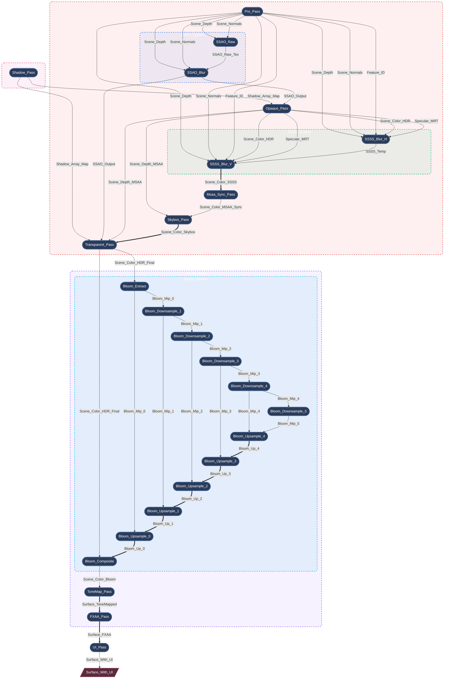

# Myth Engine Architecture: Building a Declarative Render Graph Based on SSA

## 0. Preface

Modern graphics APIs (such as WebGPU, Vulkan, and DirectX 12) grant developers unprecedented control over GPU resources and synchronization.

But this control comes at a cost.

Once your renderer exceeds a few render passes, you'll quickly find yourself bogged down in managing:
* Resource lifecycles
* Memory barriers
* Layout transitions
* Transient memory allocation
* Render order constraints

Without a robust architectural foundation, the rendering pipeline can easily crumble into a fragile mess of state management code.

I experienced this firsthand while developing the **Myth Engine**. Every time I added a new rendering feature, it became a battle against state management, with the engine's complexity rising "exponentially."

Although it worked, I'm not willing to settle for "good enough" and accumulate technical debt in the foundational layer. Therefore, I repeatedly refactored this part of the code, undergoing three rapid architectural pivots before arriving at the current design: a **strict, SSA-based declarative RenderGraph**.

---

## 1. The Road to SSA: Rapid Architectural Pivots

### Pivot 1: Hardcoded Prototype
Like many engines, the earliest prototype used a linear, hardcoded sequence of `RenderPass` calls. For a basic forward renderer, this was quick to implement. But when I started adding Cascaded Shadow Maps (CSM) and post-processing, it became untenable. Inserting a new pass meant manually reconnecting BindGroups throughout the entire main loop. Within days, I realized this path was simply not scalable.

### Pivot 2: The "Blackboard" Attempt (Manual Wiring)
Many technical articles mention that modern renderers often manage render passes using the concept of a RenderGraph. Although most only touch on it briefly, it gave me some ideas.

To decouple the passes, I quickly pivoted to a "Blackboard"-driven render graph—a common pattern in many open-source engines. Passes communicated by reading and writing resources from a global hash map keyed by strings. This was easy to understand and implement, and it did decouple the code, but it exposed severe architectural flaws during development:

* **VRAM Wastage:** Unable to know exactly who was the last user of a resource, the system had to conservatively extend resource lifecycles (often for the entire frame). Dynamically allocated resources were often retained longer than necessary, completely missing opportunities for transient memory reuse.
* **Implicit Data Flow:** Because passes interacted via global blackboard keys, their dependencies were hidden. This made it impossible to statically analyze the true data flow or safely reorder the execution of passes.
* **Validation Nightmare:** Manually tracking resource lifecycles, manually adjusting texture load/store operations, and explicitly inserting memory barriers led to constant WGPU validation errors in complex frame setups. Tracking down and debugging rendering issues became exceptionally difficult.

### Pivot 3: SSA-Based Declarative Rewrite (Current Design)
Realizing these fatal flaws of the blackboard pattern, I decided to completely rewrite the render graph. **A RenderGraph shouldn't just be a hash map of textures; it needs to become a compiler.**

Similar ideas appear in several modern engines (like Frostbite's Render Graph and Unreal Engine's RDG). Myth Engine's RDG shares similar philosophies with these systems but adheres more strictly to the principles of **SSA (Static Single Assignment)** .

With this architecture, we have finally eliminated manual resource management entirely. Now, render passes only need to declare their topological requirements (e.g., `builder.read_texture(id)`). The graph compiler takes this immutable logical topology and automatically performs **topological sorting**, **automatic lifecycle management**, **dead pass elimination**, and **aggressive memory aliasing**.

---

## 2. Core Philosophy: Strict SSA in Rendering

At the heart of the Myth Engine RDG (Render Dependency Graph) is the concept of **SSA (Static Single Assignment)** .
SSA is an intermediate representation common in compilers, where its core tenet is: each variable is assigned exactly once.

In traditional rendering, a pass might simply "bind a texture and draw to it." In an SSA RenderGraph, a logical resource (`TextureNodeId`) is immutable. Once a pass declares itself as the producer of a resource, no other pass can ever write to that exact logical ID again.

**But what about rendering multiple passes to the same screen buffer?**
Instead of allowing in-place mutations that would break the DAG topology, I introduced the concept of **aliasing** (`mutate_and_export`).

When a pass needs to perform a "read-modify-write" operation, it consumes the previous logical version and produces a **new** logical version. The graph compiler understands this topological chain and guarantees that, at the underlying physical level, **they alias exactly the same physical GPU memory**.

---

## 3. Lifecycle: From Declaration to Execution

The RDG's lifecycle is strictly divided into several distinct phases, ensuring passes only access the data they need exactly when they need it:

1.  **Setup (Topology Building):** In this phase, passes are purely data packets. They declare dependencies using methods like `builder.read_texture()` and `builder.create_and_export()`. No physical GPU resources exist at this point.
2.  **Compile (The Magic):** The graph compiler officially takes over. It performs topological sorting, calculates resource lifecycles, culls dead passes, and allocates physical memory using aggressive memory aliasing strategies. Required memory barriers are also automatically derived.
3.  **Prepare (Late Binding):** Physical memory is now available. Passes acquire their physical `wgpu::TextureView` handles and assemble temporary BindGroups. For example, `ShadowPass` dynamically creates its per-layer array views at this moment, achieving complete decoupling from the static asset manager.
4.  **Execute (Command Recording):** Passes record commands into a `wgpu::CommandEncoder`. Since all dependencies and barriers were perfectly resolved during the compilation phase, the execution stage is completely lock-free and efficient.

This architecture brings powerful performance and flexibility to the engine while vastly simplifying the development of new rendering features. Adding a new rendering effect is no longer an adventure into the unknown but a simple declarative operation.

---

## 4. Case Study: Automatically Generated Graph Topology

I quickly discovered the power of this architecture. Below are real-time dumps of the Myth Engine's render graph under different configurations.

> *Note: The engine provides a helper method for the RenderGraph that can compile and output the derived topology and resource dependencies in real-time, exporting them in `mermaid` format. This is incredibly useful for debugging.*

### Case 1: Navigating Complex Dependencies & Memory Aliasing

In a highly complex scene featuring Screen Space Ambient Occlusion and Screen Space Subsurface Scattering, the dependency network is intricate.

*(Legend: Single-line arrow `-->` indicates logical data dependency; double-line arrow `==>` indicates physical memory aliasing/in-place reuse)*

- **Dependency Resolution:** SSSS requires 5 different inputs across 3 different passes. You simply declare `builder.read_texture()` for these inputs. The graph compiler automatically guarantees the execution order and precisely inserts the required `ImageMemoryBarrier` transitions.
- **Memory Aliasing:** Observe the double-line arrows (`==>`) in the diagram. Follow the main color buffer: `Scene_Color_HDR ==> Scene_Color_SSSS ==> Scene_Color_Skybox ==> Scene_Color_Transparent`. Logically, they are distinct, immutable resources. Physically, however, the graph compiler intelligently overlays them onto the exact same block of high-resolution transient GPU texture memory.

### Case 2: Dead Pass Elimination

The compiler doesn't just manage memory; it actively optimizes GPU workload. What happens when we disable SSAO and SSSS but enable hardware MSAA?

*(Legend: Grey dashed nodes represent dead passes eliminated by the compiler)*

Because MSAA requires its own multisampled depth buffer, `Opaque_Pass` no longer depends on the standard depth buffer from `Pre_Pass`. With SSAO and SSSS disabled, no active pass consumes the output of `Pre_Pass`.

The graph compiler detects this zero-reference state during the compilation phase. It marks `P1(["Pre_Pass"])` as dead, automatically skipping its physical memory allocation, CPU preparation, and GPU command recording. No configuration required.

---
## 5. Unleashing the Compiler's Power: Breaking Down "Macro-Nodes"

I am extremely satisfied with this version of the architecture. Once the SSA-based declarative graph was established, it proved so powerful that it completely changed how I design high-level rendering features.

Previously, complex effects like Bloom, SSAO, or SSSS were written as "macro-nodes"—opaque RDG boxes that internally allocated ping-pong textures and dispatched multiple draw calls.

Now that the SSA compiler can perfectly deduce memory barriers and overlap transient lifecycles with zero cost, I realized we no longer needed these black boxes. I have completely flattened these macro-nodes into atomic micro-passes. A 6-level mip Bloom effect now consists of 12 completely independent RDG passes. The RDG compiler can now see every single intermediate mip texture, seamlessly recycling physical memory between the downsampling chain, the upsampling chain, and other post-processing effects.

Flattening these "macro-nodes" completely and handing them over to the RenderGraph management results in a very complex final RenderGraph. Fortunately, this is all done automatically. You only need to declare the nodes, and the graph compiler automatically builds the final RenderGraph—everything is automatic.

At the same time, to maintain mental manageability within the highly flattened graph, I introduced logical subgraphs. Render passes are written inside blocks like `graph.with_group("Bloom_System", |g| { ... })`.

When the `rdg_inspector` feature is enabled, the RDG inspector extracts this metadata and dynamically generates beautiful, recursively nested Mermaid flowcharts. Here is a real-time dump of the Myth Engine rendering a complex scene:

*(Legend: Single-line arrow --> indicates logical data dependency; double-line arrow ==> indicates physical memory aliasing/in-place reuse)*

In this way, we fully unleash the compiler's power. Each pass is an independent atomic unit, and the graph compiler can globally optimize their execution order, memory allocation, and resource aliasing without worrying about hidden side effects. And, when needed, we can organize passes and dump them using logical subgraphs to trace resource dependencies and logic flow, maintaining mental manageability.

## 6. Looking to the Future

By enforcing strict SSA and separating logical declaration from physical execution, I believe the Myth Engine's render graph is built for the future. This structural purity paves the way for easily scheduling compute nodes onto asynchronous compute queues in future engine iterations.

*Myth Engine's render graph stands as proof that modern graphics programming doesn't have to be a battle against state management. By embracing declarative data flow, we let the compiler shoulder the heavy lifting, freeing rendering engineers to focus on what matters most: the pixels.*