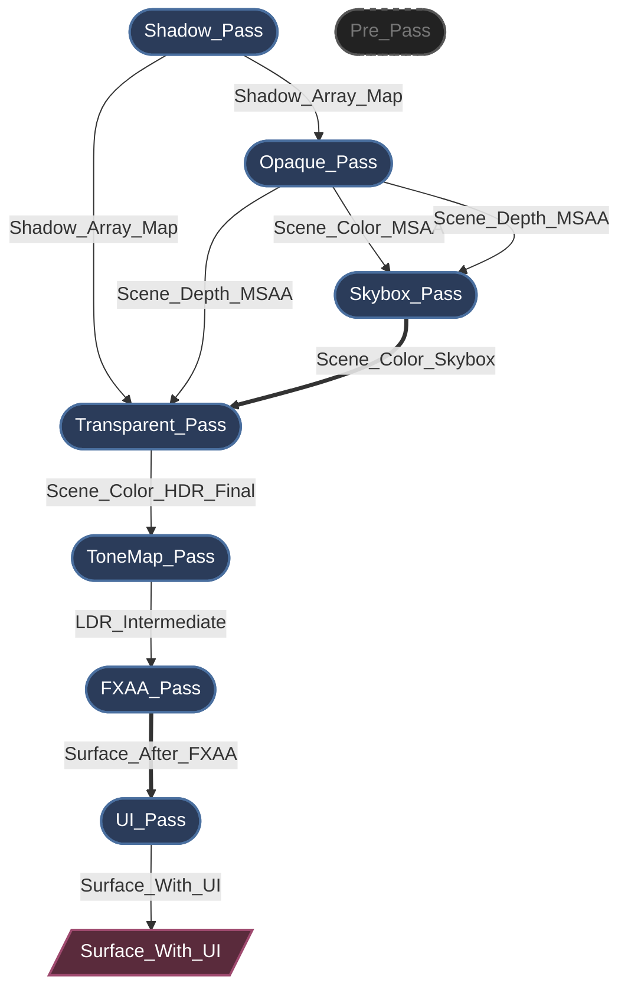
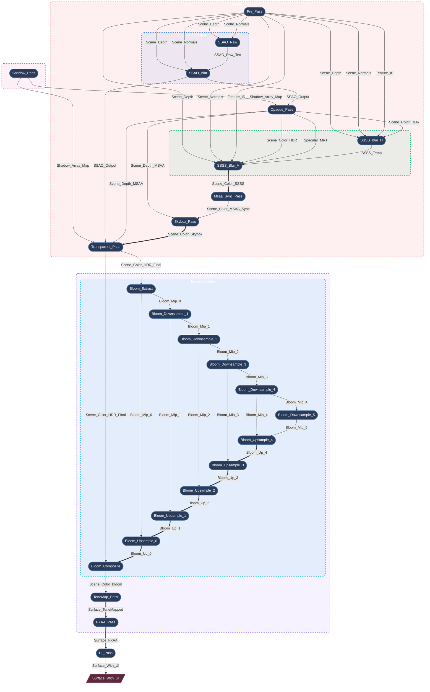

# Myth Engine Architecture: Building an SSA-based Declarative RenderGraph

## 0. Introduction

Modern graphics APIs (like WebGPU, Vulkan, and DirectX 12) give developers unprecedented control over GPU resources and synchronization.

But this control comes at a cost.

Once your renderer scales beyond a few RenderPasses, you'll quickly find yourself bogged down in a mire of managing:

* Resource lifecycles
* Memory barriers
* Layout transitions
* Transient memory allocations
* Render order constraints

Without a robust architectural foundation, a rendering pipeline can easily collapse into a fragile mess of state-management boilerplate.

While developing **Myth Engine**, I experienced this pain firsthand. Every new rendering feature felt like a battle against state management, and the engine's complexity grew exponentially.

Although it "barely worked," I wasn't willing to settle for "good enough" and accumulate technical debt at the foundational level. Therefore, I refactored this subsystem multiple times, going through three rapid architectural pivots before finally arriving at the current design: a strict, declarative RenderGraph based on **SSA (Static Single Assignment)**.

---

## 1. The Road to SSA: Rapid Architectural Pivots

### Pivot 1: Hardcoded Prototype

Like many engines, the earliest prototype utilized a series of linear, hardcoded `RenderPass` calls. For a basic forward renderer, this was very fast to write. However, when I started adding Cascaded Shadow Maps (CSM) and post-processing, it began to fall apart.

Inserting a new pass meant manually rewiring the entire BindGroup in the main loop. Within days, I realized this approach was fundamentally unscalable.

### Pivot 2: The "Blackboard" Pattern Attempt (Manual Wiring)

Many technical articles mention that modern renderers manage rendering through a "RenderGraph." Although mostly glossed over in a few strokes, this heavily inspired me. To quickly decouple the passes, I rapidly pivoted to a Blackboard-driven RenderGraph. This pattern is common in many open-source engines.

Passes communicated by reading from and writing to a global, string-keyed HashMap. It was easy to understand and successfully decoupled the code, but severe architectural flaws quickly surfaced during development:

* **VRAM Waste:** Because the system couldn't know exactly who the *last* consumer of a resource was, it had to conservatively extend resource lifecycles (usually lasting the entire frame). Dynamically allocated resources lived far longer than necessary, completely missing opportunities to recycle transient memory, resulting in terrible GPU memory utilization.
* **Implicit Data Flow:** Because passes interacted via global blackboard keys, their actual dependencies were hidden. This made it impossible to statically analyze the true data flow or safely reorder pass execution.
* **Validation Nightmare:** In complex frame setups, manually tracking resource lifecycles, adjusting texture `Load/Store` operations, and explicitly inserting memory barriers led to endless WGPU Validation Errors. Tracking down rendering bugs became a nightmare.

### Pivot 3: SSA-based Declarative Rewrite (Current Design)

Realizing the fatal issues with the Blackboard pattern, I decided to completely rewrite the RenderGraph.

**A RenderGraph shouldn't just be a HashMap of textures; it should be a compiler.**

Similar ideas appear in several modern engines (like Frostbite's Render Graph and Unreal Engine's RDG). Myth Engine's RDG shares similar philosophies with these systems but adheres more strictly to the principles of **SSA (Static Single Assignment)** .

With this architecture, we have finally eliminated manual resource management entirely. Now, a `RenderPass` simply declares its topological requirements, for example:

```rust
builder.read_texture(id);

```

The graph compiler takes this immutable logical topology and automatically performs **topological sorting**, **automatic lifecycle management**, **Dead Pass Elimination (DPE)**, and **aggressive memory aliasing**.

---

## 2. Core Philosophy: Strict SSA in Rendering

The core philosophy of Myth Engine's RDG (Render Dependency Graph) is SSA.
SSA is commonly found in compiler design, and its core idea is simple: *every variable is assigned exactly once*.

In traditional rendering, a pass might simply "bind a texture and draw to it." In an SSA RenderGraph, however, a logical resource (`TextureNodeId`) is strictly immutable. Once a pass declares itself as the producer of a resource, no other pass can write to that same logical ID.

**But what if multiple passes need to render to the same screen buffer?**

To avoid in-place modifications that would break the DAG topology, I introduced the concept of **Aliasing** (`mutate_and_export`).

When a pass needs to perform a "read-modify-write" operation, it consumes the previous logical version and produces a **new** logical version. The graph compiler understands this topological chain and guarantees that at the physical level, **they alias the exact same physical GPU memory.**

*(Here is a quick preview of how convenient it is to declare a pass in Myth Engine now:)*

```rust

let input_id = ...; // Some existing logical resource ID
let input_id_2 = ...; // Some existing logical resource ID

let pass_out = graph.add_pass("Some_Pass", |builder| {
    // Declare a read-only dependency on the input resource.
    builder.read_texture(input_id);

    // Create a brand new resource.
    let output_texture = builder.create_and_export("Some_Out_Res", TextureDesc::new(...));

    // Declare a new logical resource that aliases the input resource. (Read-Modify-Write)
    let output_texture_2 = builder.mutate_and_export(input_id_2, "Some_Out_Res", TextureDesc::new(...));

    let node = SomePassNode {
        input_texture: input_id,
        output_texture: output_texture,
        output_texture_2: output_texture_2,
    };
    (node, PassOut{output_texture, output_texture_2})
});


```

---

## 3. Lifecycle: From Declaration to Execution

The RDG's lifecycle is strictly divided into distinct phases, ensuring passes access the data they need exactly when they need it:

1. **Setup (Topology Building):** During this phase, passes are just data packets. They declare dependencies using methods like `builder.read_texture()` and `builder.create_and_export()`. At this point, zero physical GPU resources exist.
2. **Compilation (The Magic):** The graph compiler takes over. It performs a topological sort, calculates precise resource lifecycles, culls dead passes, and allocates physical memory using aggressive aliasing strategies. All necessary memory barriers are automatically deduced.
3. **Preparation (Late Binding):** Physical memory is now available. Passes acquire their physical `wgpu::TextureView`s and assemble transient BindGroups. For example, the `ShadowPass` dynamically creates its layer-based array views at this moment, perfectly decoupled from the static resource manager.
4. **Execution (Command Recording):** Passes record commands into a `wgpu::CommandEncoder`. Because all dependencies and barriers were perfectly resolved during compilation, the execution phase is completely lock-free and extremely fast.

This architecture brings immense performance and flexibility to the engine while drastically reducing the friction of developing new rendering features. Adding a new visual effect is no longer an adventurous journey into unknown state changes; it is simply a declarative operation.

---

## 4. Immediate vs. Cached RenderGraphs

When discussing compiled RenderGraphs, a design question inevitably arises: *Should the graph be rebuilt and compiled every frame? Or should the engine cache the graph and only recompile when the topology changes?*

These two approaches represent fundamentally different architectural philosophies:

* **Retained / Cached graphs** — Track topology changes and recompile only when necessary.
* **Immediate / Per-frame graphs** — Rebuild and compile the graph every frame.

In Myth Engine, I chose the **per-frame rebuild** approach.

Thanks to several architectural choices—specifically zero-allocation compilation and cache-friendly data layouts—rebuilding the graph every frame has proven in practice to be both simpler and often faster. Let's break down why.

### 1. Compilation is Actually Very Cheap

The first misconception is that compiling a RenderGraph must be expensive. In reality, the work performed during `compile_topology` is extremely lightweight:

* Iterating over contiguous `Vec` storage to build dependency edges.
* Calculating reference counts for dead pass elimination.
* Running a topological sort (Kahn’s algorithm) on a few dozen nodes.
* Calculating resource lifecycles (`first_use` / `last_use`).
* Reusing physical textures from pre-allocated, slot-based pools.

Crucially:

* **No heap allocations**
* **No system calls**
* Pure integer math and linear memory scans

For a pipeline of medium complexity with 50–100 passes, this compilation typically takes **around 10 microseconds** on a modern CPU. Within a 16.6ms frame budget, this cost is essentially negligible.

### 2. Detecting Graph Changes Can Be More Expensive

If we want to avoid recompiling the graph, we must first determine whether the topology has changed. This creates an interesting paradox.

To detect changes, the engine still has to rebuild the current graph description every frame. Afterward, it must either:

* Compute a hash of the entire graph.
* Or perform a deep structural diff against the previous frame.

Both methods introduce their own overhead: hashing strings and descriptors, unpredictable branching, non-linear memory access, and pointer chasing. In practice, these operations often consume more CPU cycles than simply running the compilation step again.

In other words: **We spend more time checking if we should compile than we would spend actually compiling.**

### 3. Immediate Mode Greatly Simplifies API Design

Perhaps the biggest benefit of the per-frame approach is the developer ergonomics. RenderGraph code conceptually becomes similar to immediate-mode UI frameworks (like ImGui). The rendering pipeline is described declaratively every frame.

For example:

```rust
if ui.is_open() {
    graph.add_pass("UI_Blur", |builder| { ... });
}

```

Dynamic rendering features become easy to express:

* Disabling sunlight shadow passes in indoor scenes.
* UI overlays inserting temporary post-processing.
* Dynamic resolution scaling altering texture sizes.
* Optional effects (SSAO, bloom, motion blur).

The graph compiler automatically deduces the correct topology. If the system relied on cached graphs, the engine would need to manually track topology invalidations, closure capture invalidations, and resource descriptor mismatches. This would dramatically increase architectural complexity and open the door to subtle bugs like stale resources, incorrect reuse, or dangling dependencies.

For Myth Engine, the conclusion was clear: **rebuilding and compiling the RenderGraph every frame is simpler, safer, and usually just as fast.** By adopting a zero-allocation compilation model, the engine sidesteps the complexities of topology tracking while keeping CPU overhead negligible.

## 5. Case Study: Auto-Generated Graph Topology

I quickly discovered the immense power of this architecture. Below are real-time dumps of Myth Engine's RenderGraph under different configurations.

> *Note: The engine provides a utility method to dynamically compile the deduced topology and dependencies and export them in `mermaid` format. This has been an absolute lifesaver for debugging.*

### Case 1: Taming Complex Dependencies and Memory Aliasing

In a highly complex scene with Screen Space Ambient Occlusion (SSAO) and Screen Space Subsurface Scattering (SSSS), the dependency web can rapidly become chaotic.


*<center>(* **Legend:** *Single arrows `-->` represent logical data dependencies; double arrows `==>` represent physical memory aliasing / in-place reuse)</center>*

* **Dependency Resolution:** SSSS requires 5 different inputs from different passes. You simply declare `builder.read_texture()` for these inputs. The compiler guarantees the execution order and inserts the exact `ImageMemoryBarrier` transitions required.
* **Memory Aliasing:** Notice the double arrows (`==>`). Trace the main color buffer: `Scene_Color_SSSS ==> Scene_Color_Skybox ==> Scene_Color_Transparent`. Logically, they are completely distinct, immutable resources. Physically, the compiler intelligently overlaps their allocations onto the exact same, high-resolution, transient GPU texture.

### Case 2: Dead Pass Elimination (DPE)

The compiler doesn't just manage memory; it actively optimizes GPU workloads. What happens if we disable SSAO and SSSS, but enable hardware MSAA?



*<center>（* **Legend:** *Grey dashed nodes represent dead passes culled by the compiler)</center>*

Because MSAA requires its own multisampled depth buffer, the `Opaque_Pass` no longer depends on the standard depth buffer from the `Pre_Pass`. With SSAO and SSSS disabled, no active passes consume the output of the `Pre_Pass`.

The graph compiler detects this zero-reference state during compilation. It marks `P1(["Pre_Pass"])` as dead, automatically bypassing its physical memory allocation, CPU preparation, and GPU command recording. **Zero configuration required.**

---

## 6. Unleashing the Compiler: Shattering "Macro-Nodes"

I am extremely satisfied with this architecture. Once the SSA-based declarative graph was in place, it proved so powerful that it completely changed how I design advanced rendering features.

Previously, complex effects like Bloom, SSAO, or SSSS were written as "macro-nodes"—RDG black boxes that internally allocated their own ping-pong textures and dispatched multiple draw calls.

Because the SSA compiler can now perfectly deduce memory barriers and overlapping transient lifecycles with zero overhead, I realized we no longer needed these black boxes. **I completely flattened these macro-nodes into atomic micro-passes.** A 6-mip-level Bloom effect now consists of 12 fully independent RDG passes. The compiler can now "see" every intermediate mip texture, seamlessly recycling physical memory across downsampling chains, upsampling chains, and other post-processing effects.

Flattening these nodes made the final RenderGraph exceptionally complex, but fortunately, this is entirely automated. You just declare the nodes, and the compiler builds the graph.

To maintain mental manageability within such a highly flattened graph, I introduced **logical subgraphs**. Passes are written inside blocks like `graph.with_group("Bloom_System", |g| { ... })`. When the `rdg_inspector` feature is enabled, the inspector extracts this metadata and generates beautiful, recursively nested flowcharts.

Here is a real-time dump of Myth Engine rendering a complex scene:


*<center>(Legend: Single-line arrow --> indicates logical data dependency; double-line arrow ==> indicates physical memory aliasing/in-place reuse)</center>*

By doing this, we fully unleash the power of the compiler. Each pass is an independent, atomic unit. The compiler can globally optimizes their execution order, memory allocation, and resource aliasing without worrying about hidden side effects. Meanwhile, logical subgraphs keep the developer's cognitive load perfectly manageable.

## 7. Looking Ahead

By enforcing strict SSA and decoupling logical declaration from physical execution, Myth Engine's RenderGraph lays a solid foundation for the future. This structural purity paves the way for easily scheduling compute nodes onto asynchronous compute queues in future iterations of the engine.

It also proves that modern graphics programming doesn't have to be a desperate struggle against state management. By embracing declarative data flow, we let the compiler do the heavy lifting, allowing rendering engineers to focus purely on drawing pixels.*