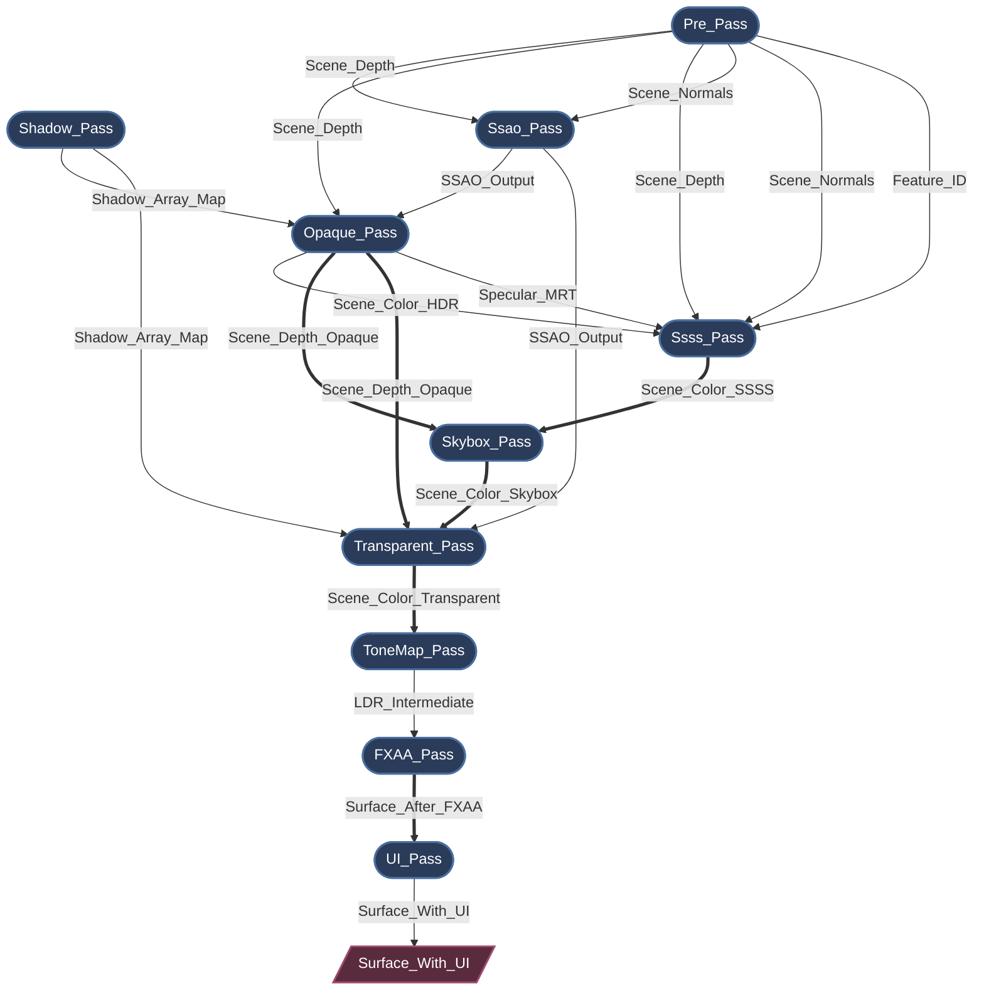

# Myth Engine Architecture: Building a Declarative, SSA-Based Render Graph

Modern graphics APIs like WebGPU, Vulkan, and DirectX 12 give developers unprecedented control over GPU resources and synchronization.

But that control comes at a cost.

Once a renderer grows beyond a few passes, you quickly end up managing:

* resource lifetimes
* memory barriers
* layout transitions
* transient allocations
* pass ordering constraints

Without strong structure, a rendering pipeline can easily collapse into fragile state-management code.

While developing **Myth Engine**, I became deeply aware of this. I refused to settle for "good enough" and accumulate technical debt in the foundational layer. Therefore, I repeatedly refactored this part, went through three rapid architectural pivots before arriving at the current design: a **strictly declarative, SSA-based render graph**.

## 1. The Road to SSA: Rapid Architectural Pivots

### Pivot 1: The Hardcoded Prototype

Like many engines, the earliest prototype used a linear, hardcoded sequence of `wgpu::RenderPass` calls. It was fast to write for a basic forward renderer, but the moment I started adding Cascaded Shadow Maps and Post-Processing, it shattered. Inserting a new pass meant manually rewiring bind groups across the entire main loop. I realized within days that this wouldn't scale.

### Pivot 2: The "Blackboard" Attempt (Manual Wiring)

To decouple the passes, I quickly pivoted to a "Blackboard" driven Render Graph—a common pattern in many open-source engines. Passes communicated by reading and writing resources to a global string-keyed hash map.
While this decoupled the code, it introduced severe architectural flaws caught during developing:

* **VRAM Wastage:** Resources allocated dynamically were often kept alive longer than necessary, missing out on transient memory reuse.
* **Implicit Data Flows:** Because passes interacted via global blackboard keys, pass dependencies were hidden. It was impossible to statically analyze the true data flow or safely reorder passes.
* **Validation Nightmares:** Tracking manual resource lifetimes and manually adjusting Load/Store operations, as well as explicitly injecting explicit memory barriers led to constant WGPU Validation Errors during complex frame setups, it is even more difficult to track and debug rendering issues.

### Pivot 3: The SSA Declarative Rewrite (Current)

Realizing the Blackboard pattern was a dead end for a modern WGPU backend, I decided to completely rewrite the graph. A render graph shouldn't just be a hash map of textures; it needs to be a **Compiler**.

By adopting a strictly declarative, SSA-based architecture, I eliminated manual resource management entirely. Passes now only declare their topological needs (e.g., `builder.read_texture(id)`). The Graph Compiler takes this immutable logical topology and automatically performs **Topological Sorting**, **Automatic Lifetime Management**, **Dead Pass Elimination**, and **Extreme Memory Aliasing**.

## 2. The Core Philosophy: Strict SSA in Rendering

At the heart of Myth Engine's RDG is the concept of **Static Single Assignment (SSA)**.

In traditional rendering, a pass might simply "bind a texture and draw to it." In my SSA graph, a logical resource (`TextureNodeId`) is immutable. Once a pass declares itself as the producer of a resource, no other pass can write to that exact logical ID.

**But what about rendering multiple passes to the same screen?**
Instead of allowing in-place mutations that break the Directed Acyclic Graph (DAG) topology, I introduced the concept of **Aliasing** (`mutate_texture`).

When a pass needs to perform a read-modify-write operation, it consumes the previous logical version and produces a *new* logical version. The graph compiler understands this topological chain and guarantees that under the hood, they **alias the exact same physical GPU memory**.

## 3. The Lifecycle: From Declaration to Execution

The RDG lifecycle is split into strictly isolated phases, ensuring passes only access what they need, exactly when they need it:

1. **Setup (Topology Building):** Passes are purely data packets here. They declare dependencies using `builder.read_texture()` and `builder.declare_output()`. No physical GPU resources exist yet.
2. **Compile (The Magic):** The Graph Compiler takes over. It performs a topological sort, computes resource lifetimes, culls dead passes, and allocates physical memory using an aggressive Memory Aliasing strategy. Memory barriers are deduced automatically.
3. **Prepare (Late Binding):** Physical memory is now available. Passes fetch their physical `wgpu::TextureView`s and assemble transient `BindGroup`s. For example, the `ShadowPass` dynamically creates its per-layer array views exactly at this moment, completely decoupling from static asset managers.
4. **Execute (Command Recording):** Passes record commands into the `wgpu::CommandEncoder`. Since all dependencies and barriers were resolved during compilation, execution is completely lock-free.

## 4. Case Studies: Auto-Generated Graph Topologies

To demonstrate the power of this architecture, here are real-time dumps of Myth Engine's render graph under different configurations.

*Ps: The engine provides an auxiliary method for RenderGraph, which can dump the topology structure and resource dependency relationships deduced through real-time compilation of RenderGraph, and export them in `mermaid` format. This is very useful in debugging.*

### Case 1: Taming Complex Dependencies & Memory Aliasing (`Ssss_Pass`)

In a highly complex scene featuring Screen Space Ambient Occlusion (SSAO) and Screen Space Subsurface Scattering (SSSS), the dependency web is massive.

* **Dependency Resolution:** SSSS requires 5 different inputs across 3 different passes. The pass simply declares `builder.read_texture()` for these inputs. The graph automatically guarantees execution order and inserts the exact `ImageMemoryBarrier` transitions required.
* **Memory Aliasing:** Notice the double-lined arrows (`==>`). Follow the main color buffer: `Scene_Color_HDR` `==>` `Scene_Color_SSSS` `==>` `Scene_Color_Skybox` `==>` `Scene_Color_Transparent`. Logically, these are distinct immutable resources. **Physically, the Graph Compiler intelligently overlays them into the exact same high-resolution transient GPU texture.**

### Case 2: Dead Pass Elimination (The MSAA & Pre-Pass Scenario)

The compiler doesn't just manage memory; it actively optimizes the GPU workload. What happens when we disable SSAO and SSSS, but enable Hardware MSAA?

Because MSAA requires its own multi-sampled depth buffer (`Scene_Depth_MSAA`), the `Opaque_Pass` no longer relies on the standard `Scene_Depth` from the `Pre_Pass`. With SSAO and SSSS disabled, **no active pass consumes the outputs of `Pre_Pass**`.

The graph compiler detects this zero-reference state during the compilation phase. It marks `P1(["Pre_Pass"])` as **dead**, automatically bypassing its physical memory allocation, CPU preparation, and GPU command recording entirely. Zero configuration required.

## 5. Future-Proofing

By enforcing strict SSA and separating logical declarations from physical execution, Myth Engine's Render Graph is built for the future. The structural purity paves the way for trivially scheduling compute nodes (like Frustum Culling or Async Compute SSAO) onto asynchronous compute queues in upcoming engine iterations.

*The Myth Engine's Render Graph proves that modern graphics programming doesn't have to be a battle against state management. By embracing declarative data flows, we let the compiler do the heavy lifting, leaving rendering engineers free to focus on pushing pixels.*