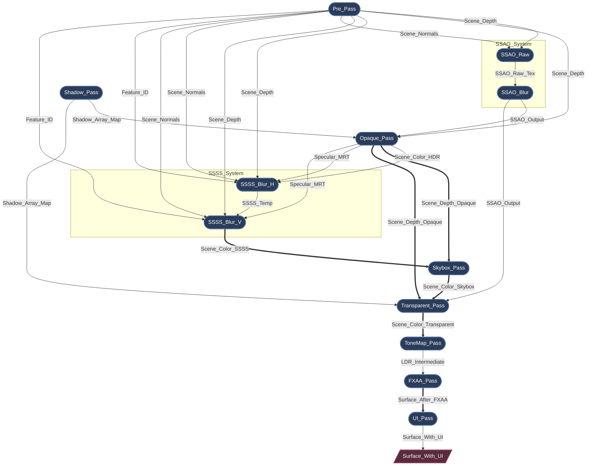
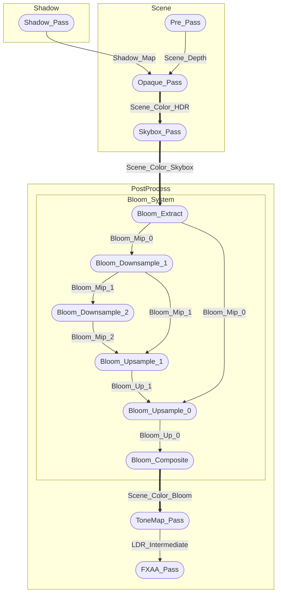

# Myth Engine Architecture: Building a Declarative, SSA-Based Render Graph

Modern graphics APIs like WebGPU, Vulkan, and DirectX 12 give developers unprecedented control over GPU resources and synchronization.

But that control comes at a cost.

Once a renderer grows beyond a few passes, you quickly end up managing:

* resource lifetimes
* memory barriers
* layout transitions
* transient allocations
* pass ordering constraints

Without strong structure, a rendering pipeline can easily collapse into fragile state-management code.

While developing **Myth Engine**, I became deeply aware of this. I refused to settle for "good enough" and accumulate technical debt in the foundational layer. Therefore, I repeatedly refactored this part, went through three rapid architectural pivots before arriving at the current design: a **strictly declarative, SSA-based render graph**.

## 1. The Road to SSA: Rapid Architectural Pivots

### Pivot 1: The Hardcoded Prototype

Like many engines, the earliest prototype used a linear, hardcoded sequence of `wgpu::RenderPass` calls. It was fast to write for a basic forward renderer, but the moment I started adding Cascaded Shadow Maps and Post-Processing, it shattered. Inserting a new pass meant manually rewiring bind groups across the entire main loop. I realized within days that this wouldn't scale.

### Pivot 2: The "Blackboard" Attempt (Manual Wiring)

To decouple the passes, I quickly pivoted to a "Blackboard" driven Render Graph—a common pattern in many open-source engines. Passes communicated by reading and writing resources to a global string-keyed hash map.
While this decoupled the code, it introduced severe architectural flaws caught during developing:

* **VRAM Wastage:** Resources allocated dynamically were often kept alive longer than necessary, missing out on transient memory reuse.
* **Implicit Data Flows:** Because passes interacted via global blackboard keys, pass dependencies were hidden. It was impossible to statically analyze the true data flow or safely reorder passes.
* **Validation Nightmares:** Tracking manual resource lifetimes and manually adjusting Load/Store operations, as well as explicitly injecting explicit memory barriers led to constant WGPU Validation Errors during complex frame setups, it is even more difficult to track and debug rendering issues.

### Pivot 3: The SSA Declarative Rewrite (Current)

Realizing the Blackboard pattern was a dead end for a modern WGPU backend, I decided to completely rewrite the graph. A render graph shouldn't just be a hash map of textures; it needs to be a **Compiler**.

By adopting a strictly declarative, SSA-based architecture, I eliminated manual resource management entirely. Passes now only declare their topological needs (e.g., `builder.read_texture(id)`). The Graph Compiler takes this immutable logical topology and automatically performs **Topological Sorting**, **Automatic Lifetime Management**, **Dead Pass Elimination**, and **Extreme Memory Aliasing**.

## 2. The Core Philosophy: Strict SSA in Rendering

At the heart of Myth Engine's RDG is the concept of **Static Single Assignment (SSA)**.

In traditional rendering, a pass might simply "bind a texture and draw to it." In my SSA graph, a logical resource (`TextureNodeId`) is immutable. Once a pass declares itself as the producer of a resource, no other pass can write to that exact logical ID.

**But what about rendering multiple passes to the same screen?**
Instead of allowing in-place mutations that break the Directed Acyclic Graph (DAG) topology, I introduced the concept of **Aliasing** (`mutate_and_export`).

When a pass needs to perform a read-modify-write operation, it consumes the previous logical version and produces a *new* logical version. The graph compiler understands this topological chain and guarantees that under the hood, they **alias the exact same physical GPU memory**.

## 3. The Lifecycle: From Declaration to Execution

The RDG lifecycle is split into strictly isolated phases, ensuring passes only access what they need, exactly when they need it:

1. **Setup (Topology Building):** Passes are purely data packets here. They declare dependencies using `builder.read_texture()` and `builder.declare_output()`. No physical GPU resources exist yet.
2. **Compile (The Magic):** The Graph Compiler takes over. It performs a topological sort, computes resource lifetimes, culls dead passes, and allocates physical memory using an aggressive Memory Aliasing strategy. Memory barriers are deduced automatically.
3. **Prepare (Late Binding):** Physical memory is now available. Passes fetch their physical `wgpu::TextureView`s and assemble transient `BindGroup`s. For example, the `ShadowPass` dynamically creates its per-layer array views exactly at this moment, completely decoupling from static asset managers.
4. **Execute (Command Recording):** Passes record commands into the `wgpu::CommandEncoder`. Since all dependencies and barriers were resolved during compilation, execution is completely lock-free.

## 4. Case Studies: Auto-Generated Graph Topologies

To demonstrate the power of this architecture, here are real-time dumps of Myth Engine's render graph under different configurations.

*Ps: The engine provides an auxiliary method for RenderGraph, which can dump the topology structure and resource dependency relationships deduced through real-time compilation of RenderGraph, and export them in `mermaid` format. This is very useful in debugging.*

### Case 1: Taming Complex Dependencies & Memory Aliasing (SSAO / SSSS Flattened)

In a highly complex scene featuring Screen Space Ambient Occlusion (SSAO) and Screen Space Subsurface Scattering (SSSS), the dependency web is massive. Both effects are **flattened** into independent micro-passes visible to the RDG compiler:

- **SSAO** is decomposed into `SSAO_Raw` → `SSAO_Blur` within an `SSAO_System` group.
- **SSSS** is decomposed into `SSSS_Blur_H` → `SSSS_Blur_V` within an `SSSS_System` group.



* **Dependency Resolution:** The flattened SSAO and SSSS passes each declare their own explicit inputs. The graph compiler deduces the correct execution order and barrier placement between `SSAO_Raw` → `SSAO_Blur` and `SSSS_Blur_H` → `SSSS_Blur_V` automatically.
* **Memory Aliasing:** Notice the double-lined arrows (`==>`). Follow the main color buffer: `Scene_Color_HDR` `==>` `Scene_Color_SSSS` `==>` `Scene_Color_Skybox` `==>` `Scene_Color_Transparent`. Logically, these are distinct immutable resources. **Physically, the Graph Compiler intelligently overlays them into the exact same high-resolution transient GPU texture.**
* **Flattening Benefit:** Previously, SSAO and SSSS were monolithic macro-nodes with hidden internal sub-passes. After flattening, the intermediate textures (`SSAO_Raw_Tex`, `SSSS_Temp`) are first-class RDG citizens — the allocator can alias their memory with other non-overlapping resources.

### Case 2: Dead Pass Elimination (The MSAA & Pre-Pass Scenario)

The compiler doesn't just manage memory; it actively optimizes the GPU workload. What happens when we disable SSAO and SSSS, but enable Hardware MSAA?


Because MSAA requires its own multi-sampled depth buffer (`Scene_Depth_MSAA`), the `Opaque_Pass` no longer relies on the standard `Scene_Depth` from the `Pre_Pass`. With SSAO and SSSS disabled, **no active pass consumes the outputs of `Pre_Pass**`.

The graph compiler detects this zero-reference state during the compilation phase. It marks `P1(["Pre_Pass"])` as **dead**, automatically bypassing its physical memory allocation, CPU preparation, and GPU command recording entirely. Zero configuration required.

## 5. Logical Grouping & Inspector (`rdg_inspector`)

As the number of passes grows, a flat list of nodes in a topology dump becomes hard to reason about. To solve this without imposing any runtime cost in production builds, the RDG introduces **logical pass groups** gated behind the `rdg_inspector` Cargo feature.

### `with_group` — Zero-Cost Pass Grouping

`RenderGraph::with_group(name, closure)` scopes all `add_pass` calls inside the closure under a named group:

```rust
let surface = graph.with_group("PostProcess", |g| {
    // Bloom is internally flattened into a Bloom_System subgroup:
    // Extract → Downsample_1..N → Upsample_N..0 → Composite
    let scene_color = bloom_pass.add_to_graph(g, scene_color, karis, max_mips);

    // Every Feature returns its output TextureNodeId — pure dataflow chain
    let mut surface = tone_map_pass.add_to_graph(g, scene_color, surface_out);
    surface = fxaa_pass.add_to_graph(g, surface, surface_out);
    surface
});
```

When **`rdg_inspector`** is enabled:
- `with_group` pushes the group name onto an internal stack, stamps every `PassRecord.group` created within, then pops the stack.
- `dump_mermaid()` uses these group annotations to emit Mermaid `subgraph` blocks, producing a hierarchically grouped topology diagram.

When **`rdg_inspector`** is disabled (the default):
- `with_group` compiles down to `#[inline(always)] f(self)` — zero overhead, zero metadata, zero allocations.

### `PassNode` Trait Purification

The `PassNode` trait has been reduced to a minimal two-method interface:

```rust
pub trait PassNode: Send + Sync + 'static {
    fn prepare(&mut self, ctx: &mut PrepareContext) {}
    fn execute(&self, ctx: &ExecuteContext, encoder: &mut CommandEncoder);
}
```

Pass naming is no longer a concern of the node itself. Names are provided externally via `RenderGraph::add_pass(name, closure)` and stored in the `PassRecord`. This separation keeps pass nodes as pure GPU command recorders while the graph owns all metadata.

### Mermaid Subgraph Output

With `rdg_inspector` enabled, `dump_mermaid()` produces grouped topology diagrams:



This makes it straightforward to identify logical pipeline stages at a glance, especially when debugging complex frame compositions with dozens of passes.

## 6. Pure Dataflow Chain & Macro-Node Flattening

### Strict Return Policy

Every `Feature::add_to_graph()` method **must** return its output `TextureNodeId`. Even terminal passes that write directly to the swap-chain surface return the mutated surface handle via `mutate_and_export`. This strict constraint transforms the `FrameComposer` into a pure functional pipeline:

```rust
// Every Feature returns a TextureNodeId — the Composer threads them as a chain
let scene_color = bloom_feature.add_to_graph(graph, scene_hdr, karis, max_mips);
let mut surface = tone_map_feature.add_to_graph(graph, scene_color, surface_out);
surface = fxaa_feature.add_to_graph(graph, surface, surface_out);
```

No pass may silently consume or discard a `TextureNodeId`. The Rust type system enforces this — `#[must_use]` on the returned ID makes the compiler reject any call site that ignores the output.

### Macro-Node Flattening

Complex multi-step effects like Bloom, SSAO, and SSSS were previously monolithic "macro-nodes" — a single `PassNode` that internally looped over multiple `begin_render_pass` calls. This hid fine-grained dependencies from the RDG compiler, preventing:

- **Optimal barrier placement** between individual sub-steps.
- **Memory aliasing** between intermediate textures with non-overlapping lifetimes.

All three effects have been flattened into independent micro-passes:

**Bloom** decomposes into Extract → Downsample chain → Upsample chain → Composite:

```text
Bloom_Extract (Scene HDR → Bloom_Mip_0)
  → Bloom_Downsample_1 (Bloom_Mip_0 → Bloom_Mip_1)
  → Bloom_Downsample_2 (Bloom_Mip_1 → Bloom_Mip_2)
  → ...
  → Bloom_Upsample_N (Bloom_Mip_N + Bloom_Mip_N-1 → Bloom_Up_N-1)
  → ...
  → Bloom_Upsample_0 (Bloom_Up_1 + Bloom_Mip_0 → Bloom_Up_0)
  → Bloom_Composite (Scene HDR + Bloom_Up_0 → Scene_Color_Bloom)
```

Each mip level is an **independent 2D transient texture** with explicit RDG lifetime tracking. The allocator automatically discovers that textures like `Bloom_Mip_0` and `Bloom_Mip_2` have non-overlapping lifetimes and maps them to the **same physical GPU memory** — achieving aggressive memory aliasing with zero manual intervention.

The `with_group("Bloom_System")` wrapper preserves visual hierarchy in topology dumps while the individual passes remain first-class RDG citizens.

**SSAO** decomposes into 2 passes within `SSAO_System`:

```text
SSAO_Raw (Scene Depth + Normals → SSAO_Raw_Tex)
  → SSAO_Blur (SSAO_Raw_Tex + Depth + Normals → SSAO_Output)
```

The intermediate `SSAO_Raw_Tex` is now a first-class transient resource whose memory can be aliased once `SSAO_Blur` completes.

**SSSS** decomposes into 2 passes within `SSSS_System`:

```text
SSSS_Blur_H (Scene_Color_HDR → SSSS_Temp)
  → SSSS_Blur_V (SSSS_Temp → Scene_Color_SSSS via mutate_and_export)
```

The `SSSS_Temp` scratch texture is explicitly visible to the allocator, and the vertical pass writes back to the scene colour via the standard SSA alias chain.

## 7. Render Target Load Operations: `RenderTargetOps`

The `get_color_attachment` helper on `ExecuteContext` accepts a `RenderTargetOps` enum that forces every pass to **explicitly declare its load operation intent**:

```rust
pub enum RenderTargetOps {
    /// Clear to a specific colour before drawing.
    Clear(wgpu::Color),
    /// Preserve existing contents (valid only for alias / external resources).
    Load,
    /// Contents are undefined — the pass will overwrite every pixel.
    /// Mapped to `LoadOp::Clear(BLACK)` for TBDR bandwidth savings.
    DontCare,
}
```

### Why not `Option<Color>`?

The previous API used `Option<Color>` where `None` had ambiguous semantics:
- For a freshly created transient resource, `None` silently became `DontCare`.
- For an alias (via `mutate_and_export`), `None` silently became `Load`.

This made it impossible to distinguish intentional "don't care" from accidental "forgot to set a clear colour." The enum eliminates this ambiguity.

### First-Write Validation

When `RenderTargetOps::Load` is used on a **freshly created** transient resource (not an alias, not external), the system panics with a descriptive message. Loading uninitialised memory is always a bug — the validation catches it at the earliest possible moment.

### Semantic Guidelines

| Scenario | Recommended Op |
|----------|---------------|
| Scene clear (first draw to a new texture) | `Clear(color)` |
| Full-screen replace shader (tone-map, FXAA, downsample) | `DontCare` |
| Additive overlay on an existing alias (skybox, UI, upsample) | `Load` |
| Stencil-tested partial write on alias (SSSS vertical) | `Load` |

## 8. Future-Proofing

By enforcing strict SSA and separating logical declarations from physical execution, Myth Engine's Render Graph is built for the future. The structural purity paves the way for trivially scheduling compute nodes (like Frustum Culling or Async Compute SSAO) onto asynchronous compute queues in upcoming engine iterations.

*The Myth Engine's Render Graph proves that modern graphics programming doesn't have to be a battle against state management. By embracing declarative data flows, we let the compiler do the heavy lifting, leaving rendering engineers free to focus on pushing pixels.*