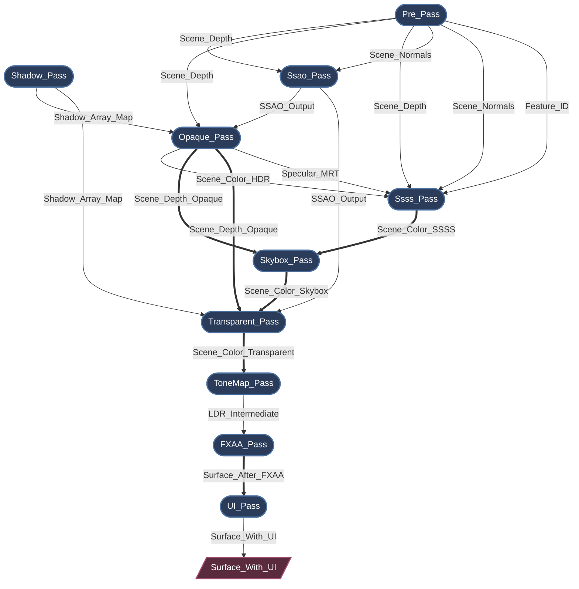

# Myth Engine 架构：构建基于SSA的声明式渲染图

## 0. 引言

现代图形 API（如 WebGPU、Vulkan 和 DirectX 12）赋予了开发者前所未有的 GPU 资源与同步控制能力。

但这种控制是有代价的。

一旦你的渲染器扩展到超过几个 RenderPass，很快就会发现自己陷入了管理以下内容的泥潭：

*   资源生命周期
*   内存屏障
*   布局转换
*   瞬时内存分配
*   渲染顺序约束

如果没有强大的架构支撑，渲染管线很容易就会崩塌成一堆脆弱的状态管理代码。

在开发 **Myth Engine** 的过程中，我深切地体会到了这一点。每次添加新的渲染特性，都是一次与状态管理的战斗，引擎的状态管理复杂度呈“指数级上升”。

虽然它“勉强能用”，但我不愿意满足于“足够好”，并在基础层面累积技术债务。因此，我多次重构了这个子系统，经历了三次快速的架构转向，最终才得到当前的设计：一个基于 **SSA（Static Single Assignment）** 的、**严格的、声明式的 RenderGraph**。

---

## 1. 通往 SSA 之路：快速架构 Pivot

### Pivot 1: 硬编码原型

像许多引擎一样，最早的原型采用了一系列线性、硬编码的 `RenderPass` 调用。对于一个基础的前向渲染器来说，这写起来非常快。但是，当我开始添加 Cascaded Shadow Maps (CSM) 和后处理时，它开始显得力不从心了。

插入一个新的 Pass 意味着要在主循环中手动重新连接整个 BindGroup。没过几天，我就意识到这种方法从根本上说是不可扩展的。

### Pivot 2: “黑板”模式的尝试（手动连接）

许多技术文章提到现代渲染器通过 “RenderGraph” 来管理渲染的，虽然大多只是寥寥几笔带过，但这确实给了我很大的启发。为了快速解耦 Pass，我迅速转向了一种 Blackboard 驱动的 RenderGraph。这种模式在许多开源引擎中很常见。

Pass 通过向一个以字符串为键的全局 HashMap 中读写资源来进行通信。这很容易理解，并且成功地解耦了代码，但在开发过程中很快暴露了严重的架构缺陷：

*   **VRAM 浪费：** 因为系统无法确切知道谁是资源的 *最后一个* 消费者，它不得不保守地延长资源生命周期（通常持续整个 frame）。动态分配的资源存活时间远超必要，完全错过了回收瞬时内存的机会，GPU 内存利用率极差。
*   **隐式数据流：** 因为 Pass 通过全局黑板键进行交互，它们实际的依赖关系被隐藏了。这使得无法静态分析真实的数据流，也无法安全地重排序 Pass 的执行。
*   **验证噩梦：** 在复杂的帧设置中，手动追踪资源生命周期、调整纹理的 `Load/Store` 操作、显式插入内存屏障，导致了无休止的 WGPU Validation Error。追踪渲染错误变成了一场噩梦。

### Pivot 3: 基于 SSA 的声明式重写（当前设计）

意识到 Blackboard 模式的致命问题后，我决定彻底重写 RenderGraph。

**一个 RenderGraph 不应该只是一个纹理 HashMap；它应该是一个编译器。**

类似思想出现在多个现代引擎中（如 Frostbite 的 Render Graph 和 Unreal Engine 的 RDG），Myth Engine 的 RDG 与这些系统理念类似，但在设计上更加严格地采用 **SSA (Static Single Assignment, 静态单赋值)** 。

通过这种架构，我们终于完全消除了手动资源管理。现在，RenderPass 只需声明它们的拓扑需求，例如：

```rust
builder.read_texture(id);
```
图编译器接收这个不可变的逻辑拓扑，并自动执行 **拓扑排序**、**自动生命周期管理**、**Dead Pass Elimination (DPE)** 以及 **激进的内存 aliasing**。

---

## 2. 核心理念：渲染中的严格 SSA

Myth Engine 的 RDG（Render Dependency Graph）的核心理念是 SSA。
SSA 常见于编译器设计中，其核心思想很简单：*每个变量只被赋值一次*。

在传统渲染中，一个 Pass 可能只是简单地“绑定一个纹理并绘制到它”。而在 SSA RenderGraph 中，一个逻辑资源（`TextureNodeId`）是严格不可变的。一旦一个 Pass 声明自己是某个资源的生产者，其他 Pass 绝对不能写入同一个逻辑 ID。

**但是，如果有多个 Pass 需要渲染到同一个屏幕缓冲区呢？**

为了不进行会破坏 DAG 拓扑的就地修改，我引入了 **Aliasing** 的概念（`mutate_and_export`）。

当一个 Pass 需要执行“read-modify-write”操作时，它会消费前一个逻辑版本并产生一个 **新的** 逻辑版本。图编译器理解这个拓扑链，并保证在物理层面，**它们 alias 指向同一块物理 GPU 内存。**

*（以下是现在 Myth Engine 中声明一个 Pass 的便捷性的快速预览：）*

```rust

let input_id = ...; // 某个现有的逻辑资源 ID
let input_id_2 = ...; // 某个现有的逻辑资源 ID

let pass_out = graph.add_pass("Some_Pass", |builder| {
    // 声明对输入资源的只读依赖。
    builder.read_texture(input_id);

    // 创建一个全新的资源。
    let output_texture = builder.create_and_export("Some_Out_Res", TextureDesc::new(...));

    // 声明一个 alias 输入资源的新逻辑资源。（Read-Modify-Write）
    let output_texture_2 = builder.mutate_and_export(input_id_2, "Some_Out_Res", TextureDesc::new(...));

    let node = SomePassNode {
        input_texture: input_id,
        output_texture: output_texture,
        output_texture_2: output_texture_2,
    };
    (node, PassOut{output_texture, output_texture_2})
});

```

---

## 3. 生命周期：从声明到执行

RDG 的生命周期被严格划分为不同的阶段，确保 Pass 只在需要时精确地访问它们所需的数据：

1.  **Setup (Topology Building):** 在这个阶段，Pass 仅仅是数据包。它们使用 `builder.read_texture()` 和 `builder.create_and_export()` 等方法声明依赖。此时，零物理 GPU 资源存在。
2.  **Compilation (The Magic):** 图编译器接管。它执行 topological sort，计算精确的资源生命周期，剔除 dead passes，并使用激进的 aliasing 策略分配物理内存。所有必要的内存屏障都被自动推导出来。
3.  **Preparation (Late Binding):** 物理内存现已可用。Pass 获取它们的物理 `wgpu::TextureView` 并组装临时的 BindGroup。例如，`ShadowPass` 在此刻动态创建其基于层的 array views，完美地与静态资源管理器解耦。
4.  **Execution (Command Recording):** Pass 将命令录制到 `wgpu::CommandEncoder` 中。因为所有依赖和屏障都在编译期间完美解决，执行阶段完全无锁且非常快。

这种架构为引擎带来了巨大的性能和灵活性，同时大幅降低了开发新渲染特性时的摩擦。添加一个新的视觉效果不再是一次进入未知状态变化的冒险之旅；它只是一个简单的声明式操作。

---

## 4. Immediate vs. Cached RenderGraphs

当讨论编译型 RenderGraph 时，一个设计问题不可避免地会出现：*图应该每帧重建并编译吗？还是引擎应该缓存图，并且只在拓扑结构改变时才重新编译？*

这两种方法代表了根本不同的架构理念：
*   **Retained / Cached graphs** — 追踪拓扑变化，仅在必要时重新编译。
*   **Immediate / Per-frame graphs** — 每帧都重建并编译图。

在 Myth Engine 中，我选择了 **per-frame rebuild** 的方法。

得益于几个架构选择——特别是 zero-allocation compilation 和 cache-friendly 的数据布局——每帧重建图在实践中被证明既更简单，通常也更快。让我们来分析原因。

### 1. 编译其实非常便宜
第一个误解是编译 RenderGraph 一定很昂贵。实际上，在 `compile_topology` 期间执行的工作非常轻量：
*   遍历连续的 `Vec` 存储来构建依赖边。
*   计算引用计数以进行 dead pass elimination。
*   对几十个节点运行 topological sort（Kahn’s algorithm）。
*   计算资源生命周期（`first_use` / `last_use`）。
*   从预分配的基于 slot 的池中重用物理纹理。

重要的是：
*   **无 heap allocations**
*   **无 system calls**
*   纯整数运算和线性内存扫描

对于一个具有 50–100 个 Pass 的中等复杂度的管线，这种编译在现代 CPU 上通常需要 **大约 10 微秒**。在 16.6 毫秒的帧预算内，这个成本基本上可以忽略不计。

### 2. 检测 Graph 变化可能更昂贵
如果我们想避免重新编译图，我们必须首先确定拓扑结构是否发生了变化。这产生了一个有趣的悖论。

为了检测变化，引擎每帧仍然必须重建当前的图描述。之后，它必须要么：
*   计算整个图的 hash。
*   或者对上一帧执行深层的结构性 diff。

这两种方法都会引入自身的开销：hashing 字符串和描述符、不可预测的分支、非线性内存访问以及 pointer chasing。在实践中，这些操作消耗的 CPU 周期通常比简单地再次运行编译步骤还要多。

换句话说：**我们花费在检查是否应该编译上的时间比实际编译的时间还要多。**

### 3. 立即模式极大简化了API设计
每帧方法最大的好处或许是开发使用体验。RenderGraph 代码在概念上变得类似于 immediate-mode UI 框架（例如imgui）。渲染管线每帧以声明式方式描述。

例如：
```rust
if ui.is_open() {
    graph.add_pass("UI_Blur", |builder| { ... });
}
```

动态渲染特性变得易于表达：

*   室内场景禁用 sunlight shadow passes。
*   UI 叠加插入临时的后处理。
*   动态分辨率缩放改变纹理大小。
*   可选效果（SSAO, bloom, motion blur）。

图编译器自动推导出正确的拓扑结构。如果系统依赖于 cached graphs，引擎就需要手动追踪拓扑失效、closure capture 失效以及资源描述符不匹配。这会大大增加架构复杂性，并为诸如 stale resources、incorrect reuse 或 dangling dependencies 等细微 bug 打开大门。

对 Myth Engine 而言，结论很明确：**每帧重建和编译 RenderGraph 更简单、更安全，而且通常同样快。** 通过采用零分配编译模型，引擎避免了拓扑追踪的复杂性，同时将 CPU 开销保持在可忽略不计的水平。

## 5. 案例研究：自动生成的图拓扑

我很快发现了这种架构的强大力量。以下是 Myth Engine 在不同配置下的 RenderGraph 实时 Dump。

> *注意：引擎提供了一个实用方法，可以动态编译推导出的拓扑和依赖关系，并以 `mermaid` 格式导出。这对于调试来说简直是救命稻草。*

### Case 1: 驯服复杂的依赖与内存别名

在一个具有屏幕空间环境光遮蔽 (SSAO) 和屏幕空间次表面散射 (SSSS) 的高度复杂场景中，依赖关系网会迅速变得混乱。



*（* **图例说明：** *单箭头 `-->` 代表逻辑数据依赖；双箭头 `==>` 代表物理内存 aliasing / in-place reuse)*

*   **Dependency Resolution:** SSSS 需要来自 3 个不同 Pass 中的 5 个不同输入。你只需为这些输入声明 `builder.read_texture()`。编译器保证执行顺序，并精确插入所需的 `ImageMemoryBarrier` 转换。
*   **Memory Aliasing:** 注意双箭头（`==>`）。追踪主颜色缓冲区：`Scene_Color_HDR ==> Scene_Color_SSSS ==> Scene_Color_Skybox ==> Scene_Color_Transparent`。逻辑上，它们是完全不同的、不可变的资源。物理上，编译器智能地将它们的分配重叠到完全相同的、高分辨率的瞬时 GPU 纹理上。

### Case 2: Dead Pass Elimination (DPE)

编译器不仅管理内存，它还能主动优化 GPU 工作负载。如果我们禁用 SSAO 和 SSSS，但启用硬件 MSAA 会发生什么？


*（* **图例说明：** *灰色虚线节点代表被编译器剔除的 dead passes)*

因为 MSAA 需要其自身的 multisampled depth buffer，`Opaque_Pass` 不再依赖于来自 `Pre_Pass` 的标准 depth buffer。随着 SSAO 和 SSSS 被禁用，没有活动的 Pass 消费 `Pre_Pass` 的输出。

图编译器在编译期间检测到这个零引用状态。它将 `P1(["Pre_Pass"])` 标记为 dead，自动绕过其物理内存分配、CPU preparation 和 GPU command recording。**零配置。**

---

## 6. 释放编译器的力量：打破“宏节点”

我非常满意这个版本的架构，一旦基于 SSA 的声明式图建立起来后，它被证明是如此强大，以至于完全改变了我设计高级渲染特性的方式。

在此之前，像 Bloom、SSAO 或 SSSS 这样的复杂效果是作为“宏节点”编写的——内部自行分配 ping-pong 纹理并分派多个 draw calls 的 RDG 黑盒。

由于 SSA 编译器现在可以零成本地完美推导内存屏障和重叠的瞬时生命周期，我意识到我们不再需要这些黑盒了。**我彻底将这些 macro-nodes 扁平化为原子的 micro-passes。** 一个 6-mip-level 的 Bloom 效果现在由 12 个完全独立的 RDG passes 组成。编译器现在可以“看到”每一个中间的 Mip 纹理，在 downsampling chains、upsampling chains 和其他后处理效果之间无缝地回收物理内存。

将这些“宏节点”完全展平并交予RenderGraph管理，会使得最终的RenderGraph变得非常复杂，但幸运的是，这完全是自动化的。你只需声明节点，编译器就会构建图。

为了在如此高度扁平的图中保持心智可管理性，我引入了**逻辑子图**。Pass 在像 `graph.with_group("Bloom_System", |g| { ... })` 这样的块内编写。当启用 `rdg_inspector` 特性时，检查器会提取此元数据并生成漂亮的、递归嵌套的 Mermaid 流程图。

以下是 Myth Engine 渲染一个复杂场景的实时 Dump：


*（图例说明：单线箭头 --> 表示逻辑数据依赖；双线箭头 ==> 表示物理内存别名/原位复用）*

通过这样做，我们充分释放了编译器的力量。每个 Pass 都是一个独立的原子单元。可以在全局范围内优化它们的执行顺序、内存分配和资源 aliasing，而无需担心隐藏的副作用。同时，logical subgraphs 使开发者的认知负荷保持得完美可控。

## 7. 展望未来

通过强制实施严格的 SSA 并将逻辑声明与物理执行分离，Myth Engine 的 RenderGraph 为未来打下了良好基础。这种结构上的纯粹性为在引擎的未来迭代中轻松地将 compute nodes 调度到 asynchronous compute queues 上铺平了道路。

这也证明了现代图形编程不必是一场与状态管理的绝望斗争。通过拥抱声明式数据流，我们让编译器承担繁重的工作，使渲染工程师能够纯粹专注于绘制像素。