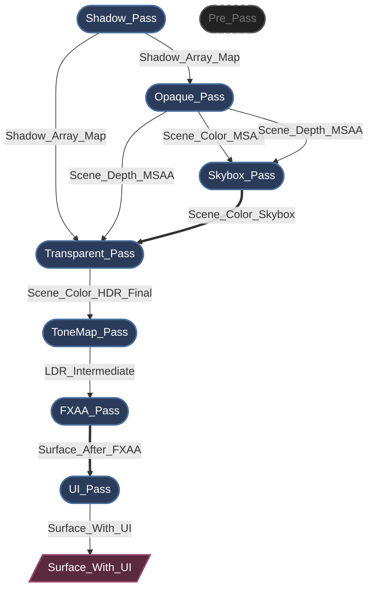
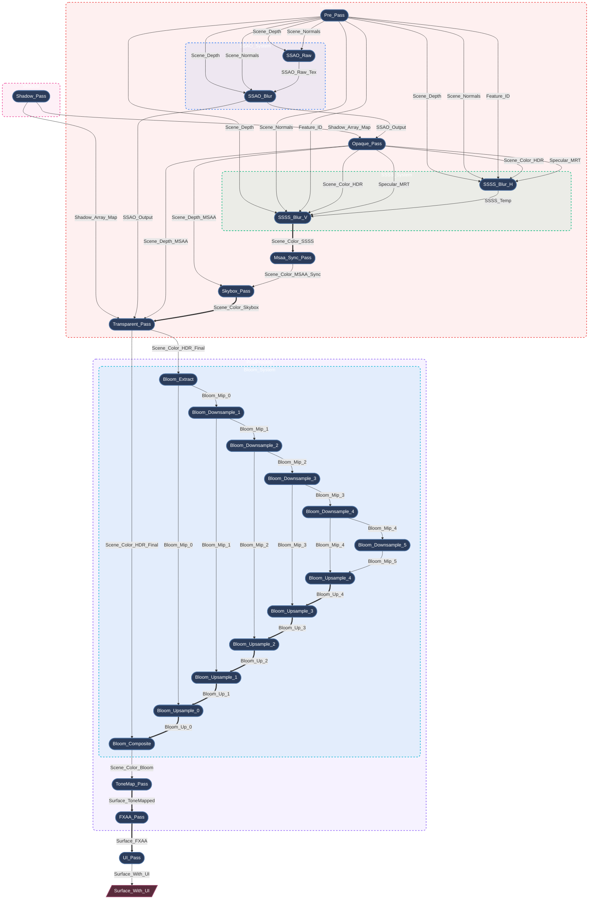

# Myth Engine 架构：构建基于 SSA 的声明式渲染图

## 0. 前言

现代图形 API（如 WebGPU、Vulkan 和 DirectX 12）赋予了开发者前所未有的 GPU 资源与同步控制能力。

但这种控制是有代价的。

一旦渲染器超过几个 RenderPass，你很快就会发现自己深陷于管理以下事务的泥沼中：
* 资源生命周期
* 内存屏障 (Memory Barriers)
* 布局转换 (Layout Transitions)
* 瞬时内存分配
* 渲染顺序约束

如果没有强大的架构支撑，渲染管线很容易就会崩塌成一堆脆弱的状态管理代码。

在开发 **Myth Engine** 的过程中，我深切地体会到了这一点。每次添加新的渲染特性，都是一次与状态管理的战斗，引擎的状态管理复杂度呈“指数级上升”。

尽管勉强可以工作，但对于底层设施，我不愿意只满足于“足够好”而在基础层积累技术债务。因此，我反复重构了这部分代码，经历了三次快速的架构转向，才最终得到了现在的设计：一个**严格的、基于 SSA 的声明式 RenderGraph**。

---

## 1. 走向 SSA 之路：快速架构转向

### 转向 1：硬编码原型
和许多引擎一样，最早的原型使用的是线性的、硬编码的 `RenderPass` 调用序列。对于基础的前向渲染器来说，这种方式写起来很快。但当我开始添加级联阴影映射 (CSM) 和后处理时，它就变得力不从心了。插入一个新的 Pass 意味着要手动重新连接整个主循环中的 BindGroup。几天之内我就意识到，这条路根本无法扩展。

### 转向 2：“黑板”尝试（手动连接）
很多技术文章提到，现代渲染器通常是通过 RenderGraph 的概念来管理 RenderPass。虽然大多都只是匆匆带过，但这确实给了我一些思路。

为了解耦各个 Pass，我迅速转向了“黑板模式 (Blackboard)”驱动的渲染图——这是许多开源引擎中常见的模式。各个 Pass 通过从全局字符串键的哈希映射中读取和写入资源来进行通信。这很易于理解和实现，也确实解耦了代码，但在开发过程中却暴露出了严重的架构缺陷：

* **显存浪费 (VRAM Wastage)：** 由于无法确切知道谁是资源的最后一个使用者，系统不得不保守地延长资源生命周期（通常是整帧）。动态分配的资源常常被保留得比实际需要更久，完全错失了瞬时内存复用的机会。
* **隐式数据流：** 由于 Pass 之间通过全局黑板键交互，它们之间的依赖关系被隐藏了。这导致我们无法静态分析真实的数据流，也无法安全地重排 Pass 的执行顺序。
* **验证噩梦：** 手动跟踪资源生命周期、手动调整 Texture 的 Load/Store 操作，以及显式插入内存屏障，导致在复杂的帧设置中不断出现 WGPU 验证错误 (Validation Errors)，追踪和调试渲染问题变得异常困难。

### 转向 3：基于 SSA 的声明式重写（当前设计）
意识到黑板模式的这些致命问题后，我决定彻底重写渲染图。**一个 RenderGraph 不应该只是纹理的哈希映射，它需要成为一个编译器。**

类似思想出现在多个现代引擎中（如 Frostbite 的 Render Graph 和 Unreal Engine 的 RDG），Myth Engine 的 RDG 与这些系统理念类似，但在设计上更加严格地采用 **SSA (Static Single Assignment, 静态单赋值)** 。

通过这种架构，我们终于完全消除了手动资源管理。现在，RenderPass 只需声明它们的拓扑需求（例如 `builder.read_texture(id)`）。图编译器接收这个不可变的逻辑拓扑，并自动执行**拓扑排序**、**自动生命周期管理**、**死节点消除 (Dead Pass Elimination)** 和**激进的内存别名 (Memory Aliasing)**。

---

## 2. 核心哲学：渲染中的严格 SSA

Myth Engine RDG (Render Dependency Graph) 的核心是 **SSA (静态单赋值)** 的概念。
SSA（Static Single Assignment）是一种常见于编译器中的中间表示，其核心思想是：每个变量只被赋值一次。

在传统渲染中，一个 Pass 可能只是简单地“绑定一个纹理并绘制到它”。而在 SSA RenderGraph 中，一个逻辑资源 (`TextureNodeId`) 是不可变的。一旦某个 Pass 声明自己是一个资源的生产者，其他任何 Pass 都不能再写入这个确切的逻辑 ID。

**但是，如果需要将多个 Pass 渲染到同一个屏幕缓冲区呢？**
我并没有允许这种会破坏有向无环图 (DAG) 拓扑的原地修改 (In-place mutations)，而是引入了**别名 (Aliasing)** 的概念 (`mutate_and_export`)。

当一个 Pass 需要执行“读取-修改-写入”操作时，它会消耗前一个逻辑版本并产生一个**新的**逻辑版本。图编译器理解这条拓扑链，并保证在底层物理层面，**它们别名 (Alias) 完全相同的同一块物理 GPU 内存**。

---

## 3. 生命周期：从声明到执行

RDG 的生命周期被严格划分为几个独立的阶段，确保 Pass 只在确切需要的时候访问它们所需的数据：

1. **设置 (Topology Building)：** 在这个阶段，Pass 纯粹是数据包。它们使用 `builder.read_texture()` 和 `builder.create_and_export()` 等方法声明依赖。此时没有任何物理 GPU 资源存在。
2. **编译 (The Magic)：** 图编译器正式接管。它执行拓扑排序、计算资源生命周期、剔除死 Pass，并使用激进的内存别名策略分配物理内存。所需的内存屏障也会被自动推导出来。
3. **准备 (Late Binding)：** 物理内存现在可用了。Pass 获取它们的物理 `wgpu::TextureView`，并组装临时的 BindGroup。例如，`ShadowPass` 正是在这个时刻动态创建其每层数组视图的，这让它与静态资产管理器实现了完全解耦。
4. **执行 (Command Recording)：** Pass 将命令录制到 `wgpu::CommandEncoder` 中。由于所有的依赖和屏障都在编译期间被完美解决，执行阶段是完全无锁且高效的。

这个架构为引擎带来了强大的性能和灵活性，同时极大地简化了新渲染特性的开发工作。新增一个渲染特效不再是一次充满未知的冒险，而变成了一个简单的声明式操作。

---

## 4. 案例研究：自动生成的图拓扑

我很快就发现了这个架构的强大之处，以下是 Myth Engine 在不同配置下的渲染图实时转储。

> *注：引擎为 RenderGraph 提供了一个辅助方法，可以实时编译推导出的拓扑结构和资源依赖关系，并以 `mermaid` 格式导出。这在调试时非常有用。*

### 案例 1：驾驭复杂依赖与内存别名

在一个包含屏幕空间环境光遮蔽和屏幕空间次表面散射的高度复杂场景中，依赖网络是复杂的。

*(图例说明：单线箭头 `-->` 表示逻辑数据依赖；双线箭头 `==>` 表示物理内存别名/原位复用)*

- 依赖解析： SSSS 在 3 个不同的 Pass 中需要 5 个不同的输入。你只需为这些输入声明 builder.read_texture()。图编译器会自动保证执行顺序，并精确插入所需的 ImageMemoryBarrier 屏障转换。
- 内存别名（Memory Aliasing）： 注意图中的双线箭头 (==>)。顺着主颜色缓冲区看：Scene_Color_HDR ==> Scene_Color_SSSS ==> Scene_Color_Skybox ==> Scene_Color_Transparent。在逻辑上，它们是截然不同的不可变资源。但在物理层面上，图编译器会智能地将它们重叠（Overlay）分配到完全相同的同一块高分辨率瞬时 GPU 纹理内存上。

### 案例 2：死节点消除（Dead Pass Elimination）

编译器不仅管理内存，还主动优化 GPU 工作负载。当我们禁用 SSAO 和 SSSS，但启用硬件 MSAA 时会发生什么？

*(图例说明：灰色虚线节点表示被编译器剔除的死节点)*

由于 MSAA 需要自己的多重采样深度缓冲区，Opaque_Pass 不再依赖来自 Pre_Pass 的标准深度缓冲区。在 SSAO 和 SSSS 禁用的情况下，没有活跃的 Pass 消耗 Pre_Pass 的输出。

图编译器在编译阶段检测到这种零引用状态。它将 P1(["Pre_Pass"]) 标记为死，自动绕过其物理内存分配、CPU 准备和 GPU 命令录制。无需任何配置。

---
## 5. 释放编译器的力量：打破“宏节点”
我非常满意这个版本的架构，一旦基于 SSA 的声明式图建立起来后，它被证明是如此强大，以至于完全改变了我设计高层渲染特性的方式。

在此之前，像 Bloom、SSAO 或 SSSS 这样的复杂效果是作为“宏节点”编写的——一个内部自己分配乒乓纹理并派发多个绘制调用的 RDG 黑盒。

由于 SSA 编译器现在可以零成本地完美推导内存屏障和重叠瞬时生命周期，我意识到我们不再需要这些黑盒了。我将这些宏节点完全扁平化为原子微 Pass。一个 6 级 mip 的 Bloom 效果现在由 12 个完全独立的 RDG Pass 组成。RDG 编译器现在可以看到每一个中间 Mip 纹理，在降采样链、升采样链和其他后处理效果之间无缝回收物理内存。

将这些“宏节点”完全展平并交予RenderGraph管理，会使得最终的RenderGraph变得非常复杂，但幸运的是，这一切是自动完成的，你只需要声明节点，然后图编译器会自动的构建最终的RenderGraph，一切都是自动的。

同时，为了在高度扁平化的图中保持心智上的可管理性，我引入了逻辑子图。RenderPass在 `graph.with_group("Bloom_System", |g| { ... })` 块内编写。

当启用rdg_inspector Feature时，RDG 检查器会提取这些元数据，并动态生成漂亮的、递归嵌套的 Mermaid 流程图。以下是 Myth Engine 渲染一个复杂场景的实时转储：

*（图例说明：单线箭头 --> 表示逻辑数据依赖；双线箭头 ==> 表示物理内存别名/原位复用）*

通过这种方式，我们完全释放了编译器的力量。每个 Pass 都是一个独立的原子单元，图编译器可以在全局范围内优化它们的执行顺序、内存分配和资源别名，而无需担心隐藏的副作用。而且，在需要的时候，我们可以通过逻辑子图来组织 Pass 并dump，以追踪资源依赖和逻辑流，保持了心智上的可管理性。

## 6. 面向未来

通过强制执行严格的 SSA 并将逻辑声明与物理执行分离，我认为 Myth Engine 的渲染图是为未来而构建的。这种结构上的纯粹性为在未来的引擎迭代中轻松地将计算节点调度到异步计算队列上铺平了道路。

*Myth Engine 的渲染图证明了现代图形编程不一定是一场与状态管理的战斗。通过拥抱声明式数据流，我们让编译器承担繁重的工作，让渲染工程师可以自由地专注于像素的呈现。*